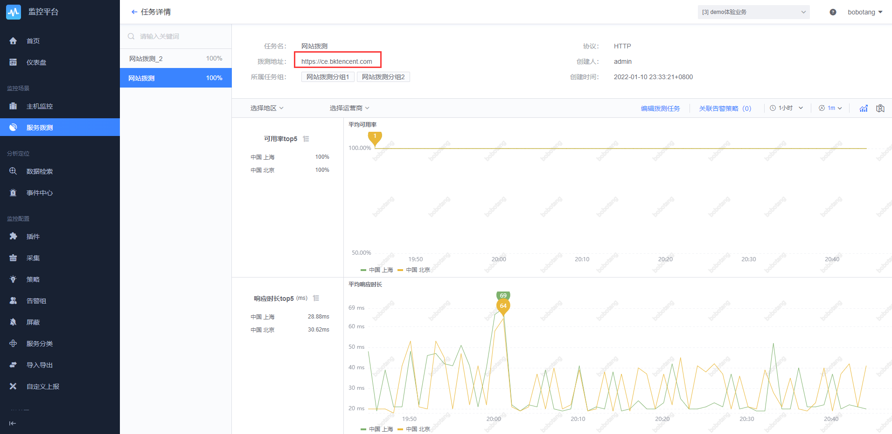

## 9、 监控平台

demo 体验业务下有安装 agent 的主机，预设了一些监控视图

### 9.1 仪表盘

### 9.2 主机监控

主机监控是监控产品的核心功能之一，无需繁琐的配置，在 Agent 安装后，即可采集到完整的操作系统主机相关指标，如下图所示。

### 9.3 主机监控视图

从主机列表上，点击主机 IP，可查看详情，如下图所示。其中左侧的主机列表，来源于 CMDB 中配置的业务拓扑。

### 9.4 告警策略配置

监控的重要功能之一是发送告警，通过配置监控策略，触发阈值即可发送告警出来，默认策略如下图所示。注意，策略是默认自带的，当主机扩容后，策略会自动匹配新增的主机目标，无需人工修改策略。

### 9.5 事件中心

当告警属于已知问题、无关紧要问题、或者常规的业务变更等情况，可对告警按需进行屏蔽，如下图所示。

### 9.6 服务拨测

服务拨测通过拨测节点向远程目标发送探测信息，来发现目标服务的状态情况。支持 TCP HTTP(s) UDP ICMP。该功能依赖服务器安装 bkmonitorbeat 采集器（demo 机器已安装）。
如内置的一个拨测线上体验环境地址的

也可以体验新创建一个拨测任务，比如

### 9.7 插件

线上体验环境内置了常见的插件，也有合作伙伴[嘉为蓝鲸](https://www.canway.net/)贡献制作的 exporter、JMX，可以参考配置，同时如果自己有私有化环境，可以申请导出到自己环境（需要申请插件管理的权限，可以到[线上体验交流专区](https://bk.tencent.com/s-mart/community/question/5612)进行申请说明）。

更多监控平台的功能探索，可参考[监控平台产品白皮书](../../Monitor/3.8/UserGuide/Overview/README.md)

---

- 您可能需要：

    1. [立即下载蓝鲸](https://bk.tencent.com/download/)
    2. 了解更多企业定制化服务：[点击咨询](https://bk.tencent.com/applyinfo/ee/)