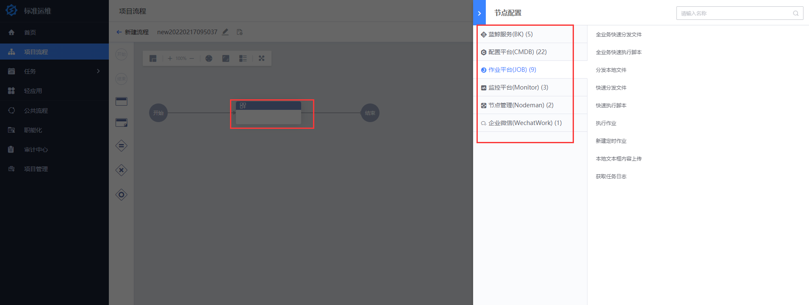
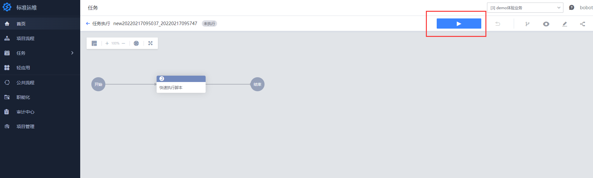

## 7、 标准运维

标准运维是通过可视化的图形界面进行多系统间的“任务流程编排”和“执行”的系统，将企业内部多系统间的工作整合到一个流程模版中，实现一键自动化调度

### 7.1 已有流程的体验

demo 体验业务下内置了多个业务场景流程，有的可以执行体验，有的仅查看示例

有可执行标签的，可以点击流程进去新建任务然后执行

### 7.2 新建流程体验

除了体验内置的流程，如果想自行配置一些流程，可以通过新建流程来实现

比如一个最简单的流程：调用作业平台的快速执行插件

- step1：选择插件

- step2：设置插件内容（脚本执行内容）

- step3：新建任务

- step4：执行任务

- step5：查看执行结果

这就完成了一个最简单的流程编排（只有一个流程节点的），更多用法可以参考已有的流程来自行体验实现（新建的流程任务测试完及时清理，如果想贡献给线上体验环境，可以到[线上体验交流专区](https://bk.tencent.com/s-mart/community/question/5612) 进行分享备注，管理员将保留）。

更多标准运维的产品功能，可见[标准运维白皮书](../../SOPS/3.28/UserGuide/Overview/README.md)

---

- 您可能需要：

    1. [立即下载蓝鲸](https://bk.tencent.com/download/)
    2. 了解更多企业定制化服务：[点击咨询](https://bk.tencent.com/applyinfo/ee/)