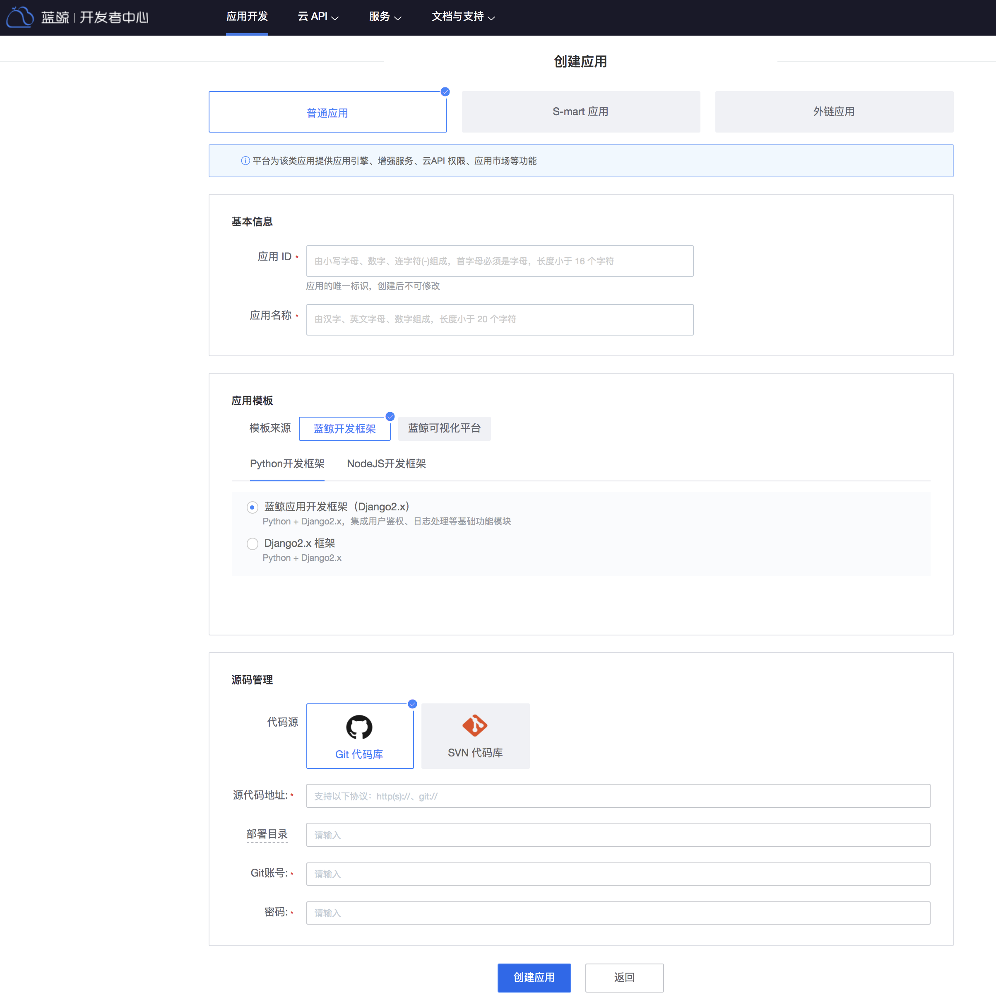
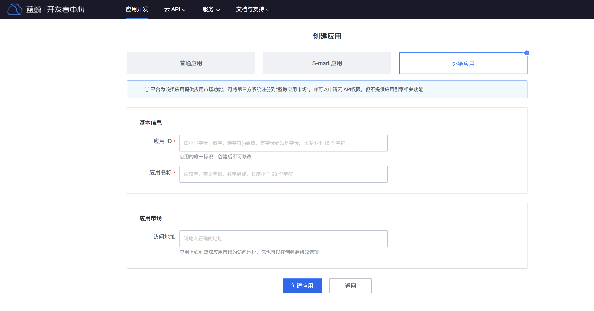

# 应用管理

蓝鲸 PaaS 平台承载着众多 SaaS，根据 SaaS 部署方式分为以下几种：

### 第一种：S-mart 应用

S-mart 应用，通过“下载 SaaS 包 -> 上传创建应用 -> 部署（正式环境）-> 配置独立域名（可选）-> 工作台进入”的方式来使用。

### 第二种： 基于代码仓库开发的普通应用

普通应用，属于开发者/用户自己研发的 SaaS 应用，代码托管在代码仓库中。按照“创建应用 -> 研发 -> 预发布环境部署 -> 正式环境部署”的方式自研工具/系统。

### 第三种：蓝鲸可视化开发平台应用

蓝鲸可视化开发平台应用可在蓝鲸可视化平台上生成源码包后，在开发者中心部署。

### 第四种：外链应用

平台为该类应用提供应用市场功能，可将第三方系统注册到“蓝鲸应用市场”，并可以申请云 API权限，但不提供应用引擎相关功能。可用于：

1. 将第三方系统放在蓝鲸桌面/工作台中使用，需要设置第三方访问地址

2. 仅用于申请 API 访问权限

