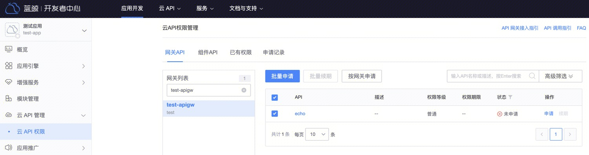
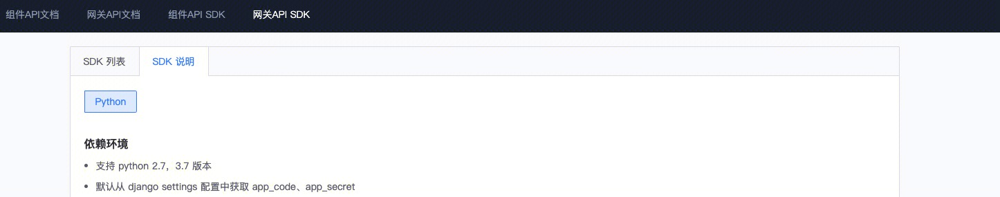

# 如何调用蓝鲸云 API

您可以通过蓝鲸云 API 访问蓝鲸平台各项服务的 API，以及蓝鲸 SaaS 应用提供的 API。

## 申请 API 调用权限

访问蓝鲸云 API，必须要申请调用权限。

在开发者中心应用页面，点击左侧菜单云 API 权限，进入云 API 权限管理页，切换到网关 API 页。

在网关列表中，筛选出待申请权限的网关，点击网关名，然后，在右侧页面选中需访问的网关 API，点击批量申请。

在申请记录中，可查看申请单详情。待权限审批通过后，即可访问网关 API。

> 提示：无需申请权限的 API，默认拥有权限，无需申请

- 管理员审批后，可以查看资源的拥有权限

> 提示：现阶段，申请 API 权限通过后，会拥有 180 天的访问权限；而且为了方便用户的持续使用，如果半年内有访问，则自动续期半年；否则，邮件通知蓝鲸应用开发者手动续期。

## API 调用

在 『API 网关』-『网关 API SDK』，在 SDK 列表页，可搜索网关的 SDK。若网关未提供 SDK，可联系网关管理员生成网关 SDK。

在 SDK 说明页，可查看如何使用网关 SDK

注意：SDK 需要配合 `BK_API_URL_TMPL` 环境变量才能正常使用，应用部署到开发者中心会自动注入这个环境变量。本地开发时，需要手动这个这个环境变量，变量的值可在开发者中心的『模块配置』-『环境变量』（普通应用：『应用引擎』-『环境配置』）页面的 “查看内置环境变量” 中获取。
