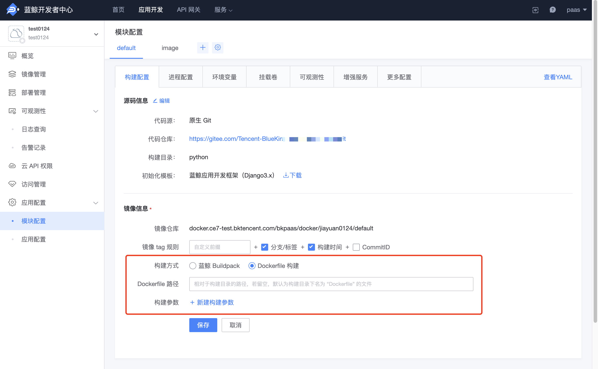
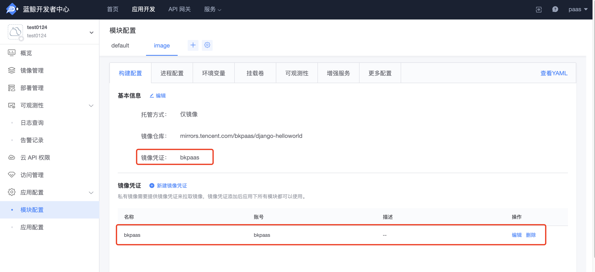

# 应用部署流程

## 如何部署一个 Django 应用

首先，我们来分析一个经典的 Django 应用应该如何进行部署：

1. 拉取代码：

```
git clone --branch release http://my.project.git
```

2. 安装合适的 Python 运行时：

```
sudo apt-get install python3.6
```

3. 安装第三方依赖：

```
pip install -r requirememts.txt
```

4. 进行数据库变更：

```
python manage.py migrate
```

5. 收集静态文件：

```
python manage.py collectstatic --noinput
```

6. 启动服务：

```
gunicorn wsgi -w 4 -b :5000
```

可见，完整部署一个应用往往需要多个步骤来完成，而每一个步骤都需要若干秒甚至若干分钟的耗时。而这也仅仅是一个实例的部署耗时，多个实例同时部署的时间消耗，往往会给业务带来无法忽略的影响。

此外，如果项目有定制化的需求时，比如需要使用一个特定版本的 Python 发行版，比如使用 pipenv 而不是 pip 来做依赖管理，这种需求会彻底改变部署流程，无可避免的让用户介入进来。

那么蓝鲸 PaaS 平台是如何解决这些部署问题，帮助应用进行容器化部署的呢？

## 蓝鲸应用的部署流程

蓝鲸 PaaS 将应用部署细分成构建与部署两个阶段：

1. 持续集成（CI）：云原生应用支持以下 3 种构建方式：

- 蓝鲸 Buildpack
- Dockerfile
- 直接提供镜像仓库

说明：通过 Buildpack、Dockerfile 这两种构建方式构建出来的镜像，会推送到开发者中心的**私有仓库**中，可在云原生应用的『镜像管理』页面查看镜像的详情。

2. 持续部署（CD）：创建新容器快速拉起对应服务，并提供自动扩缩、挂载卷、自定义域名解析等多项功能。

通过将复杂耗时的多个构建工作合并到构建阶段，避免了部署多个实例时的重复构建工作，使得实际部署时可以快速拉起服务。

## 蓝鲸 Buildpack 构建

蓝鲸 PaaS 平台使用 [heroku buildpack api](https://devcenter.heroku.com/articles/buildpack-api) 兼容的框架驱动不同类型的构建工具。

> 构建工具是什么？ 构建工具是一组将代码转换成特定运行环境的脚本，一般与某一种编程语言相关，负责依赖安装，编译或安装运行时等工作。

构建工具会对项目进行检测是否需要进行构建，一般根据特征文件来决定。以一个经典的 Python 应用为例，假设应用以 pip 来管理依赖，那么项目结构应该如下：

```
.
├── demo
├── requirements.txt
└── setup.py
```

此时构建工具会识别到构建目录（未设置则默认为根目录）的 requirements.txt，调用 `pip install -r requirements.txt` 安装依赖。

另外，如果应用使用 pipenv 来管理依赖，那么项目结构应该如下：

```
.
├── Pipfile
├── Pipfile.lock
├── demo
└── setup.py
```

构建工具会识别构建目录（未设置则默认为根目录）的 Pipfile，调用 `pipenv install` 安装依赖。

**说明**：如果项目目录下同时有 `Pipfile` 文件和 `requirements.txt` 文件，则会以 `Pipfile` 为准。

构建工具预设了对应技术栈常见的构建方案，只要项目满足标准规范，就能自动进行运行时的构建。同时构建工具也提供了一些钩子来帮助用户处理不规范的项目或添加自定义的构建操作：

- bin/pre-compile：构建之前进行调用，可以修改项目结构；
- bin/post-compile：构建之后进行调用，可以进行静态文件收集或数据库变更操作；

钩子需要放置于项目 bin 目录下，格式为可执行的脚本命令。

### 复合项目的构建

构建工具提供了特定运行环境的构建方案，通过多个构建工具的配合，可以进行复合项目的构建。多个构建工具会被按加载顺序逐个调用，最终构建出完整的运行环境。

假设一个 Django 应用需要使用 webpack 来打包 vue，目录结构如下：

```
.
├── backend
│   ├── __init__.py
│   └── views.py
├── frontend
│   └── App.vue
├── package.json
├── requirements.txt
└── manage.py
```

可见这个项目使用两种语言进行开发，backend 是使用 Python 开发的后台应用，frontend 则是 Vue 的前端应用。

对于这类的复合项目，可以通过加载 Node.js 和 Python 两个构建工具，同时进行构建：

- Node.js 构建工具根据 package.json，安装 Node 运行时并执行 npm run build 来构建静态文件；
- Python 构建工具根据 requirements.txt，安装 Python 运行时并执行 pip install -r requirements.txt 来安装依赖；

**注意事项：**

- [构建(Build)阶段钩子](../paas/build_hooks.md)在每个构建工具执行后都会被触发。

## Dockerfile 构建

新增 Dockerfile 构建，支持用户自定义构建过程，完成各种编程语言的应用代码构建。

可以在 『模块配置』-『构建配置』- 镜像信息中，设置 Dockerfile 路径和构建参数。



## 直接提供镜像仓库

除了基于源码的部署方式以外，蓝鲸 PaaS 平台还支持使用 Docker 镜像部署应用，可以解决部分依赖难安装、构建慢等问题。

如果是私有镜像需要在『模块配置』-『构建配置』中新增镜像凭证，并配置在镜像的基本信息中。



### 使用 Arm 架构的机器如何构建 x86 平台镜像

Docker 支持通过 buildx 工具来构建跨平台的镜像，详情请查阅[官方文档](https://docs.docker.com/desktop/multi-arch/#multi-arch-support-on-docker-desktop)。

```bash
docker buildx create --use
docker buildx inspect --bootstrap
# 在这里我们必须在构建阶段同时做推送动作，因为多平台构建仅会保存在构建缓存中
docker buildx build --platform linux/amd64,linux/arm64 -t ${你的镜像 tag} --push .
```

## 总结

本文仅是对蓝鲸应用构建部署流程的的一个简单原理解析，列出的命令不能完全代表构建工具的真实工作。事实上，一个构建工具不仅仅是一些自动化脚本，还需要依赖源，不同版本的运行时环境和周边工具的配合。得益于构建工具，蓝鲸应用只需要保持标准的项目规范，无需关心具体的部署细节，实现了一次构建，多次部署的效果。
