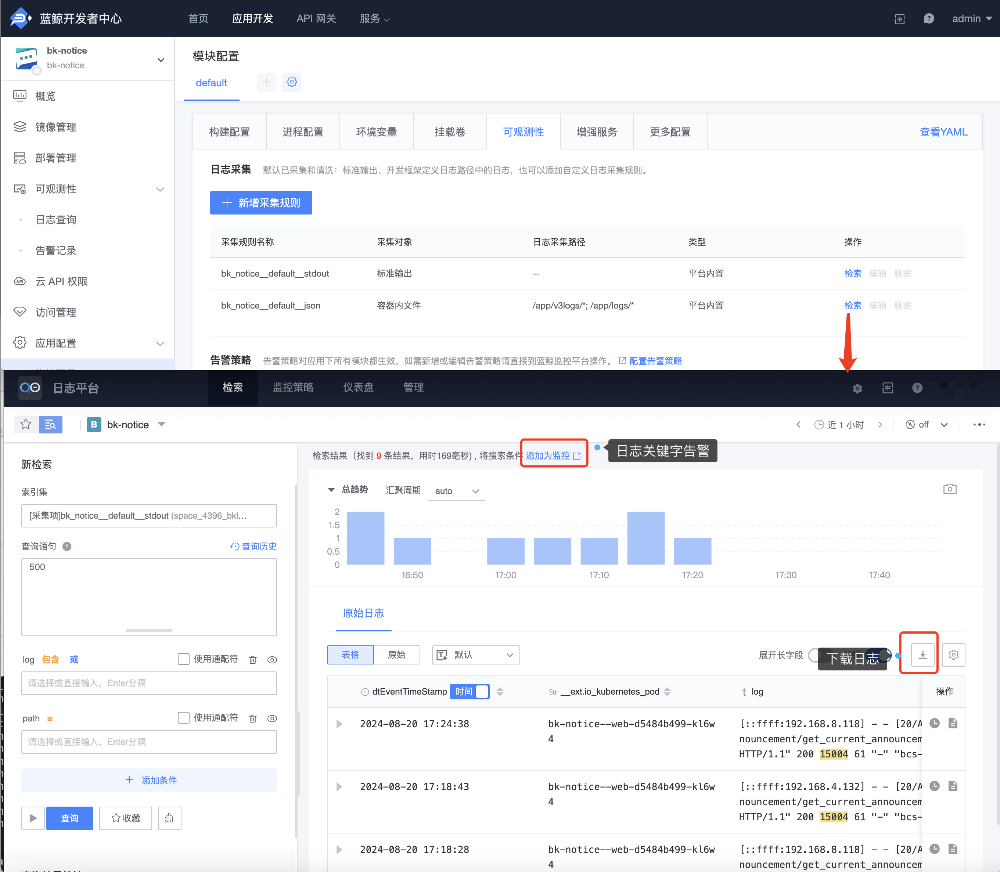

# 日志高级功能介绍

开发者中心现已支持通过蓝鲸日志平台采集应用日志，借助这一强大的平台，开发者能够利用多项高级功能来管理和分析日志数据。这些功能包括日志关键字检索、高级告警设置、日志下载等，极大提升了日志管理的灵活性和效率。

## 主要功能

### 1.日志关键字高级

在『模块配置』-『可观测性』-『日志采集』页面，可以直接通过”检索“功能跳转到蓝鲸日志平台上对应的蓝鲸应用命名空间下，进行日志关键字的高级检索，并根据检索内容配置日志关键字告警。

### 2.日志下载

开发者可以直接在蓝鲸日志平台的『检索』页面下载所需的日志文件，以便进行离线分析或存档。

### 3.自定义上报

在蓝鲸日志平台的『管理』-『自定义上报』页面，开发者可以新增日志采集规则和修改日志清洗规则。

**说明**： 该功能默认未启用，如需启用请参考[部署文档](../../../../../../DeploymentGuides/7.2/manual-install-bkce.md#paas-app-log)
