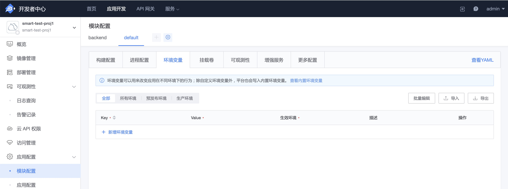

# 自定义环境变量

## 为应用设置环境变量

为了更好的灵活性，我们建议使用环境变量来管理应用的一些配置信息，你可以在应用的管理页面修改环境变量的值。

为了避免与系统变量发生冲突，变量名必须符合以下要求：

- 由大小写英文字母、数字或者下划线组成
- 长度不能超过 50 个字符
- 不能使用平台内置环境变量前缀

例如：`CONFIGVAR_TEST` 就是一个合法的变量名。

### 如何设置环境变量

操作入口：

- 普通应用：『应用引擎-环境配置』
- 云原生应用：『模块配置-环境变量』

环境变量可以指定生效的环境（预发布环境和生产环境），选择全部环境会同时将环境变量应用到所有环境中。

**注意**：环境变量添加后需要重新部署才能使改动生效。



### 如何获取变量值

在应用代码中，你可以通过任何能够访问到环境变量的途径来获取你所设置的变量值。比如，在 Python 中：

```python
import os
os.environ.get('CONFIGVAR_TEST')
```

> 提示：修改环境变量配置后，应用必须进行重新进行部署，才会在对应环境生效。

## 平台保留环境变量

平台保留一些环境变量以便管理（[内置环境变量说明](./builtin_configvars.md)），会规避常用名称避免冲突。因此平台保留以下环境变量：

- SLUG_URL
- HOME
- S3CMD_CONF
- HOSTNAME

或者含有以下前缀的环境变量：

- IEOD\_
- BK\_
- BKPAAS\_
- KUBERNETES\_
