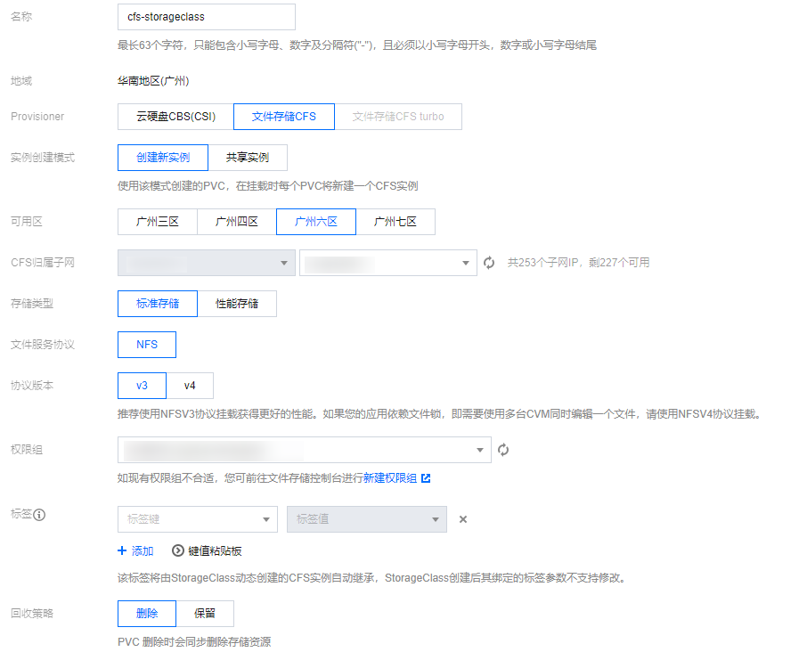

# 持久存储配置开启指引

开发者中心的持久存储功能为多个模块和进程提供了一个共享的数据源，实现了数据的共享与交互，并确保了数据在系统故障或重启后的持久化和完整性。
开发者中心持久存储功能基于 [Kubernetes StorageClass](https://kubernetes.io/zh-cn/docs/concepts/storage/storage-classes/) 实现， 因此需要在开发者中心的应用集群中开启相关配置才可使用此功能。

## 创建 StorageClass

如果应用集群是 BCS 集群上
， 且 Kubernetes 提供商为 tencentCloud，具体配置可在 `BCS 容器平台 --> 集群管理 --> 集群 --> 基本信息` 查看， 开发者中心建议使用 [CFS（腾讯云文件存储）](https://cloud.tencent.com/document/product/457/44234)作为持久存储的提供商。

### [安装文件存储扩展组件](https://cloud.tencent.com/document/product/457/44234)

1. 登录 [容器服务控制台](https://console.qcloud.com/tke2)，在左侧导航栏中选择集群。
2. 在集群列表中，单击目标集群 ID，进入集群详情页。
3. 选择左侧菜单栏中的 **组件管理**，在组件管理页面单击 **新建**。
4. 在 **新建组件管理** 页面中勾选 CFS（腾讯云文件存储）。
5. 单击完成即可创建组件。

### [创建 CFS StorageClass](https://cloud.tencent.com/document/product/457/44235)

1. [创建子网](https://cloud.tencent.com/document/product/215/36517)， 在创建集群的时候可能已经配置， 可以直接复用。
2. [创建权限组](https://cloud.tencent.com/document/product/582/10951)，登录 [文件存储控制台](https://console.cloud.tencent.com/cfs)，点击左侧权限组，创建权限组后添加权限组规则。
3. 创建 StorageClass

- 登录容器服务控制台
- 左侧点击集群， 根据集群 ID 进入集群详情页面
- 点击左侧存储，添加 StorageClass， 将前面创建的子网、 权限等填入表单， StorageClass name 建议设置为 cfs

## 配置开发者中心

开发者中心配置 `DEFAULT_PERSISTENT_STORAGE_CLASS_NAME = your_storage_class_name`（默认值为 cfs），如果您的 StorageClass name 就是 cfs， 可以不配置。

## 为 SaaS 应用开启持久存储特性

在开发者中心 admin42 打开 `应用详情页面 --> 基本设置 --> 特性管理 --> 开启持久存储挂载卷`
