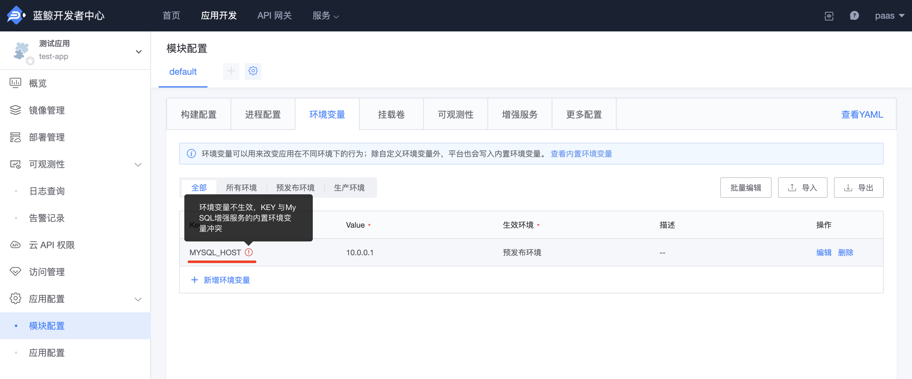
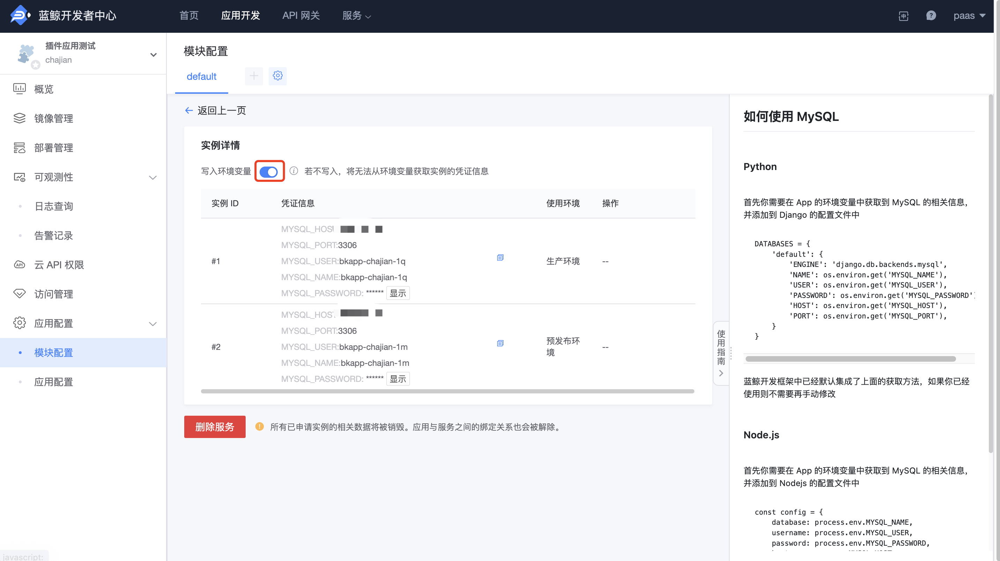

# 如何修改增强服务环境变量

增强服务启用后，会将增强服务的配置信息写入到应用的环境变量中，且增强服务的写入内置环境变量优先级最高，所以手动在环境变量配置中修改增强服务的配置信息并不会生效。

如果想覆盖增强服务写入的内置环境变量，你可以按以下步骤操作：

#### 1. 关闭增强服务环境变量的写入

操作入口：

- 云原生应用：『模块配置』-『增强服务』- 实例详情
- 普通应用：『增强服务』- 实例详情

**说明**：关闭该选项后，增强服务将不会再向预发布环境和生产环境写入相关的环境变量。请注意，关闭后需重新部署对应的环境才能生效。

#### 2. 手动在环境变量中写入增强服务的配置信息

操作入口：

- 云原生应用：『模块配置』-『环境变量』
- 普通应用：『应用引擎』- 『环境配置』

**注意**：如果生产环境和预发布环境中的配置信息不一致，请分别在各环境中添加所需的环境变量。

通过以上步骤，您将能够成功覆盖增强服务写入的内置环境变量，并按需配置应用环境。
