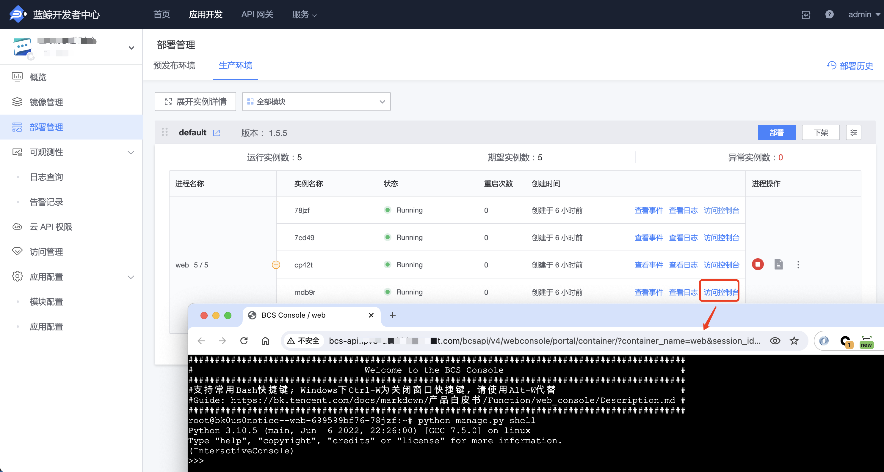

# 访问控制台

### 什么是访问控制台

访问控制台基于蓝鲸容器服务的 Webconsole 功能，用户可以通过控制台进入到进程所在的容器内。

功能入口：

- 云原生应用：『部署管理』- 展开实例详情 - 访问控制台
- 普通应用：『应用引擎』-『进程管理』- 访问控制台

### 访问控制台能做什么

通过访问控制台可以进入应用进程的容器内，实现包括但不限于以下的功能点：

- 查看线上运行的代码

- 在线调试，比如 Django 应用可以通过 `python manage.py shell` 调试

- 执行一次性命令， 如 `python  manage.py <command> [options]` 等
