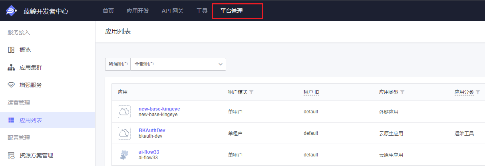
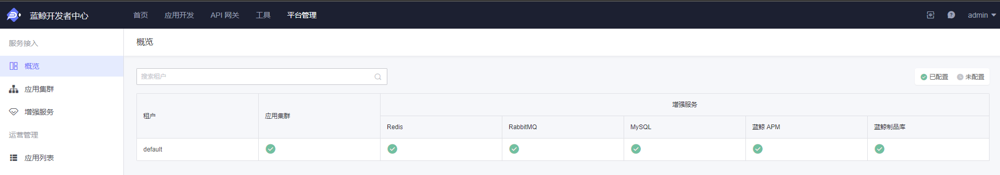
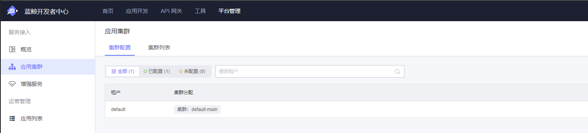
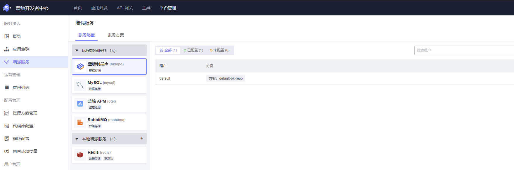
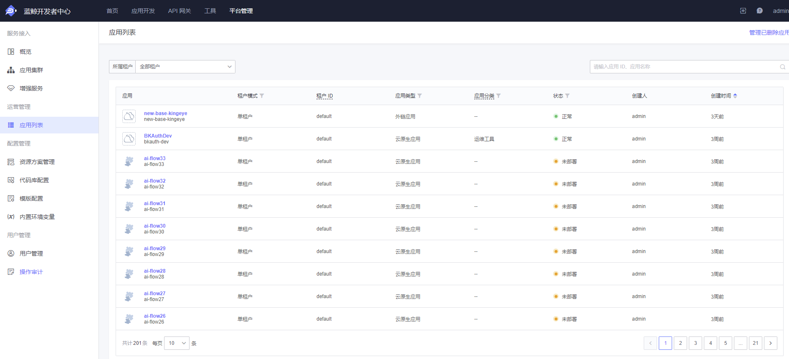
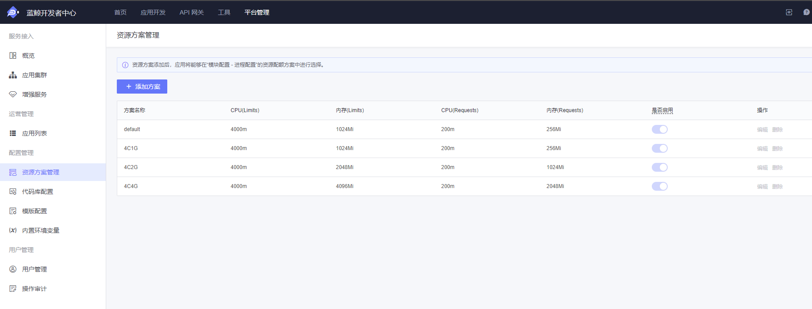
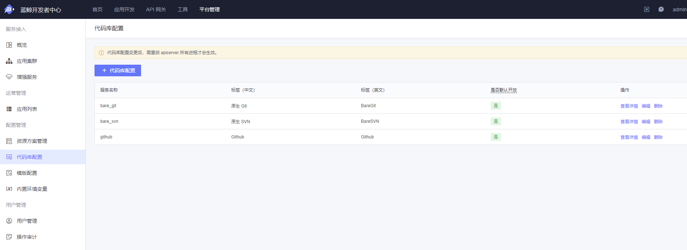
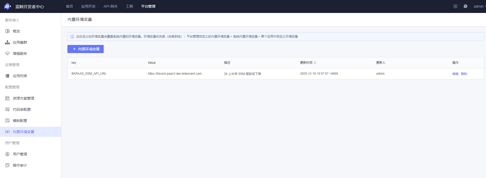
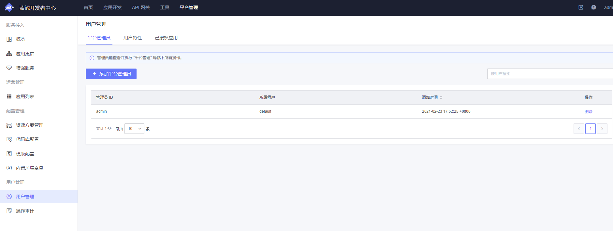

# 系统维护

PaaS3.0 平台提供了基础的维护方式，让管理员可以基于 WEB 页面进行简单的维护操作。

开发者中心导航栏-平台管理
访问地址：{PaaS3.0开发者中心访问地址}/plat-mgt/apps

说明：
1. 初始仅 `admin` 账号可访问管理后台
2. 必须先打开并登录到 PaaS3.0 开发者中心后，才能正常打开访问后台管理。



若接入了自定义登录后没有 `admin` 账号，可以进入 `bkpaas3-apiserver-web` pod 执行如下命令添加其他管理员账号：

```python
from bkpaas_auth.core.constants import ProviderType
from bkpaas_auth.models import user_id_encoder
from paasng.infras.accounts.models import UserProfile

username="your_name"
user_id = user_id_encoder.encode(ProviderType.BK.value, username)
UserProfile.objects.update_or_create(user=user_id, defaults={'role': 4, 'enable_regions': 'default'})
```

## 1. 概览 (Overview)
**功能入口**: `平台管理` -> `概览`


在此页面，您可以查看所有租户的基础设施配置状态。
*   **租户搜索**: 顶部搜索框支持按租户名称快速查找。
*   **状态图例**:
    *   **已配置**: 表示该项服务已启用。
    *   **未配置**: 表示该项服务未启用。
*   **租户列表**:
    *   **应用集群**: 显示该租户是否已分配应用集群。点击“去配置”可跳转至集群管理。
    *   **增强服务**: 显示该租户下的增强服务（如 MySQL, Redis 等）启用情况。点击“去配置”可跳转至服务配置。

## 2. 平台管理 (Platform)
### 2.1 应用集群 (App Cluster)
**功能入口**: `平台管理` -> `应用集群`

管理应用运行所需的容器集群资源。
*   **集群列表**: 查看当前已接入的集群信息。
*   **配置**: 支持添加新集群或编辑现有集群的连接信息和调度策略。

### 2.2 增强服务
**功能入口**: `平台管理` -> `增强服务`

管理平台提供的各类增强服务（Add-ons）。
*   **服务配置**: 为不同租户开启或关闭特定的增强服务。
*   **服务方案**: 定义增强服务的规格套餐（例如：512M 内存/1G 存储），供开发者在申请服务时选择。

## 3. 运营 (Operations)
### 3.1 应用列表
**功能入口**: `平台管理` -> `应用列表`

全平台应用查询与管理中心。
*   **筛选**:
    *   **所属租户**: 下拉选择特定租户，查看其名下应用。
    *   **搜索**: 支持输入应用 ID 或应用名称进行模糊搜索。
*   **应用信息**:
    *   展示应用 Logo、名称、应用 ID (Code)。
    *   **租户模式**: 标识应用是“单租户”还是“全租户”模式。
    *   **分类**: 应用所属的业务分类。
    *   **状态**: 正常 / 已下架。
    *   **负责人**: 应用的创建者或管理员。
*   **彻底删除**: 对于已软删除（下架）的应用，在此页面可以执行**彻底删除**操作，清除所有数据。

## 4. 配置管理 (Config)
### 4.1 资源方案管理
**功能入口**: `平台管理` -> `资源方案管理`

定义应用容器可申请的 CPU 和内存配额方案。
*   **添加方案**: 创建新的资源规格模板（如：标准型 1C2G）。
*   **方案管理**:
    *   **启用/禁用**: 控制方案是否对开发者可见。
    *   **编辑/删除**: 修改或移除自定义方案（内置方案不可删除）。

### 4.2 代码库配置
**功能入口**: `平台管理` -> `代码库配置`

配置平台对接的代码仓库信息，支持 Git 和 SVN。
*   **功能**: 添加代码仓库的认证信息（Token/账号密码）和 API 地址，确保应用构建时能正常拉取代码。

### 4.3 模版配置
**功能入口**: `平台管理` -> `模版配置`

管理创建应用时可选的初始化模版。
*   **功能**: 定义模版的名称、来源仓库及适用场景。

### 4.4 内置环境变量
**功能入口**: `平台管理` -> `内置环境变量`

管理注入到应用运行环境中的全局变量。
*   **优先级**: 平台管理自定义 > 系统内置 > 应用自定义。
*   **操作**: 添加 Key-Value 键值对，这些变量将在应用构建和运行时生效。

## 5. 用户管理 (User)
### 5.1 用户管理
**功能入口**: `平台管理` -> `用户管理`

包含三个子功能模块：
1.  **平台管理员 (Platform Admin)**:
    *   查看管理员列表。
    *   **添加管理员**: 将普通用户提升为平台管理员，授予平台管理权限。
2.  **授权应用 (Authorized App)**:
    *   管理被授予特殊权限的内部应用（如能够调用非公开 API 的应用）。
3.  **用户特性 (User Feature)**:
    *   **特性开关**: 针对特定用户开启或关闭实验性功能（Feature Flags）。

### 5.2 操作审计
**功能入口**: `平台管理` -> `操作审计`

查看平台管理相关的操作日志。
*   **搜索**: 支持按操作人筛选。
*   **时间筛选**: 支持按时间范围查询。
*   **列表字段**: 操作对象、操作类型、对象属性、状态、操作人、操作时间。
*   **查看详情**: 点击“查看”可显示操作前后的详细差异对比。
