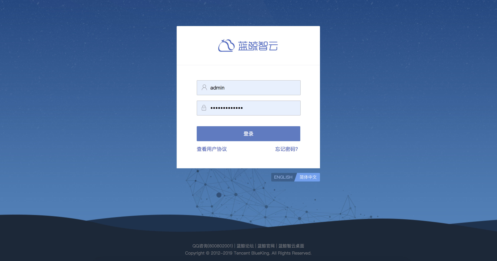

# 用户管理

为了保证使用蓝鲸产品的用户都是可信的，PaaS 平台为整个蓝鲸体系提供了“统一登录”模块，该模块包含了基本账号体系。当搭建部署好蓝鲸体系的产品后，会提供一个 URL 给用户访问。

用户的账号密码等基本信息是通过“用户管理”的 SaaS 来完成的。用户在 PaaS 平台内，或者其他系统内是否有该系统的某些权限，是通过“权限中心”的 SaaS 来申请与获取的。

综上所述，关于在蓝鲸体系内的用户管理可以进行如下划分：

- 用户信息
通过用户管理的 SaaS 来进行企业组织架构的划分、用户信息录入、用户密码查找与修订等操作。

- 用户权限

  - 系统开发者
  可以将自己的系统接入到权限中心，在蓝鲸体系内进行统一管理。

  - 产品使用者
  可以根据自己的需要，选择按照系统/用户组去获取响应的权限。
