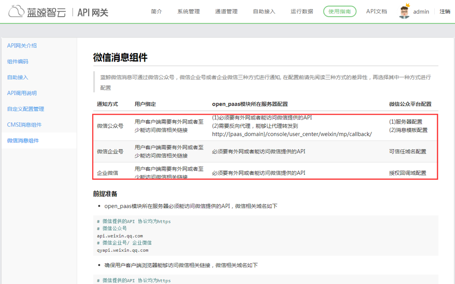
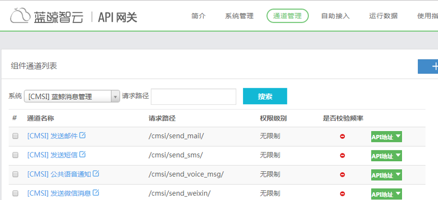
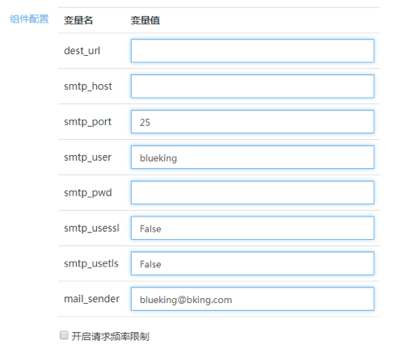

# 如何配置通知渠道，如邮件、微信、短信等

蓝鲸内置了邮件、微信的通知渠道，以“admin”的角色进入“开发者中心”->“API 网关”->“使用指南”->“微信消息组件”，可以参考详细的教程进行配置。该配置属于整个蓝鲸体系的通用配置。

通知渠道配置入口

温馨提示：

软件属于私有部署到企业内部使用，企业需要提供已有的邮件、微信、短信等通知渠道。

1\. 邮件：可使用已有的邮箱账号。

2\. 微信：可前往微信官网申请账号，蓝鲸不提供公共账号，请确保可以访问 [weixin.qq.com](https://weixin.qq.com/)。

3\. 短信：默认提供的是腾讯云的短信渠道，需要用户购买腾讯云的 sms 服务。

三种通知渠道，均提供了可页面化的配置方式，无需进行二次开发；若想修订，可在后台进行编码调整。

通知渠道 API

点击“发送邮件”底部显示的参数信息。

邮件渠道配置参数图

- dest_url: 若用户不擅长用 Python，可以提供一个其他语言的接口，填到 dest_url，ESB 仅作请求转发即可打通邮件配置

- smtp_host: SMTP 服务器地址 (注意区分企业邮箱还是个人邮箱)

- smtp_port: SMTP 服务器端口 (注意区分企业邮箱还是个人邮箱)

- smtp_user: SMTP 服务器账号 (mail_sender 相同)

- smtp_pwd:  SMTP 服务器账号密码 (一般为授权码)

- smtp_usessl: (默认为 1)

- mail_sender: 默认的邮件发送者 (smtp_user 相同)

点击“发送微信消息”底部显示的参数信息。

微信渠道配置参数图

