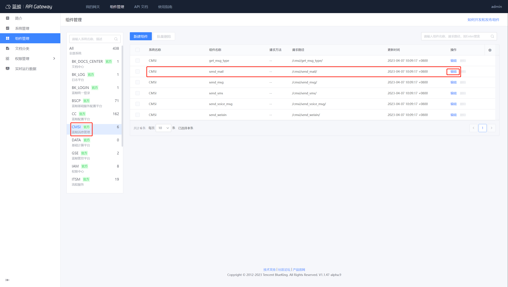

# 配置消息通知：邮件

1. 打开 `http://apigw.${BKDOMAIN}/components/access`
2. 找到系统：CMSI
3. 找到组件：send_mail，点击右侧“编辑”

4. 点击“编辑”，编辑组件配置

## 组件配置

- dest_url: 若用户不擅长用 Python，可以提供一个其他语言的接口，填到 dest_url，ESB 仅作请求转发即可打通邮件配置
- smtp_host: SMTP 服务器地址 (注意区分企业邮箱还是个人邮箱)
- smtp_port: SMTP 服务器端口 (注意区分企业邮箱还是个人邮箱)
- smtp_user: SMTP 服务器账号
- smtp_pwd: SMTP 服务器账号密码 (一般为授权码)
- smtp_usessl: 默认为 False
- smtp_usetls: 默认为 False
- mail_sender: 默认的邮件发送者 (smtp_user 相同)

## 配置示例

本示例以 QQ 邮箱为示例

### 1、开启 SMTP 服务

QQ 邮箱的 SMTP 服务，默认是关闭的。

登录 QQ 邮箱，点击顶部导航栏的 “设置” -> 账户 -> 找到 “POP3/SMTP 服务” 和 “IMAP/SMTP 服务” 项，点 “开启”。


<center>开启服务</center>

开启之后，点击“生成授权码”，这个授权码将作为 `smtp_pwd`。

### 2、配置 send_mail 组件

QQ 邮箱 SMTP 默认配置如下，具体可参考：https://service.mail.qq.com/cgi-bin/help?subtype=1&&id=20010&&no=1000557

```yaml
smtp_host：smtp.qq.com
smtp_port：465
smtp_user：demo@qq.com （个人QQ邮箱地址）
smtp_pwd：授权码
smtp_usessl：True
```
- 详细配置方法如下：


### 3、测试接口

使用 Postman 工具请求为例

-  请求地址：
```bash
POST http://bkapi.${BK_DOMAIN}/api/c/compapi/cmsi/send_mail/
```
- 请求参数：
```json
{
    "bk_app_code":"<替换为你的 bk_app_code>",
    "bk_app_secret":"<替换为你的 bk_app_secret>",
    "bk_username": "admin",
    "receiver": "654321@qq.com",
    "sender": "123456@qq.com",
    "title": "This is a Test",
    "content": "<html>Welcome to Blueking</html>"
}
```
其中 sender 一定要跟管道配置 smtp_user 保持一致


### 4、排查接口问题

1. 找到 bk-esb Pod，观察其异常日志
```bash
kubectl logs -n blueking -f bk-apigateway-bk-esb-xxxx
```
2. 请检查是否将端口打开
  - 入站流量放开 465 端口


## 视频指引

▶️[如何配置邮件消息管道](https://www.bilibili.com/video/BV1NS4y1q7aT/)