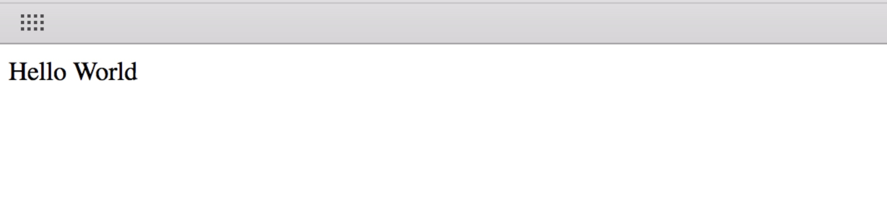

# Windows 下输出 Hello,World

`Windows 10` 基于 `蓝鲸开发框架 2.0` 上输出 `Hello,World!`

## 环境准备

1. 搭建好蓝鲸环境并配置 host，能正常访问蓝鲸
2. 安装 Python 3.6.X、MySQL 5.X、git、开发工具(Pychram 或 Visual Studio code)
3. 创建项目代码仓库、创建蓝鲸应用、下载开发框架至本地解压

> 注意：付费工具需要自行购买

### 安装 Python 3.6.X

下载 Python 3.6.X 的 [Windows x86-64 executable installer](https://www.python.org/downloads/)（现在一般都是 64 位系统）

勾选 `Add Python 3.6 to PATH`，按提示安装即可。


安装包会自动安装 `pip`


### 安装 MySQL 5.X

- [官网下载 MySQL](https://dev.mysql.com/downloads/mysql/),选择`.msi`文件进行下载 ，按提示安装即可。

- 数据库管理工具

Navicat Premium、phpMyAdmin、DBeaver、MySQL Workbench 等

### 安装 git

- [官网下载 git](https://git-scm.com/download/win),下载 `Git-xxx-64-bit.exe`文件，按提示安装即可。可参考[官方安装文档](https://git-scm.com/book/zh/v2/起步-安装-Git)

- git 管理工具

Sourcetree、GitHub Desktop、Fork、TortoiseGit、开发工具 Git 插件 等

### 创建项目代码仓库

创建应用前，需提前准备代码仓库(Git/SVN)，推荐 `Git`

创建代码仓库，例如 `GitHub` 或 `GitLab` 或者 `Gitee`

### 创建蓝鲸应用

- 开发者中心创建应用

进入`蓝鲸PaaS平台` -> `开发者中心` -> `应用创建` ，填写上一步获取的 `git` 仓库地址和账号，创建成功后会获取 `应用 ID:{APP_ID}`、`应用 TOKEN:{SECRET_KEY}` ，这两个变量后续会用到。

### 下载开发框架至本地

进入 [蓝鲸工具下载](../../../../../downloads/7.0/Index.md)，下载最新的开发框架至本地，并解压

## 初始化开发框架

1. 配置本地 hosts
2. 配置虚拟环境
3. 配置环境变量
4. 创建本地数据库
5. 安装框架依赖
6. 初始化本地数据库
7. 启动本地项目

### 配置本地 hosts

- 先修改本地 hosts

```127.0.0.1 dev.{PAAS_URL}```

例：`127.0.0.1 dev.paas.bktencent.com`

> 启动开发框架，需要使用 域名
> 
### 配置虚拟环境

> 可选：只有一个开发项目的可忽略。Pycharm 可以帮忙创建虚拟环境。

- [修改 pip 源](https://pip.pypa.io/en/stable/user_guide/#config-file) (国内镜像)

    在 `C:\Users\{YOUR_USERNAME}\AppData\Roaming` (Windows 10 默认隐藏 `AppData` 目录，需先去掉隐藏)目录中创建 `pip` 文件夹，在 pip 文件夹下创建 `pip.ini`

    ```bash
    [global]
    trusted-host = pypi.tuna.tsinghua.edu.cn
    index-url = https://pypi.tuna.tsinghua.edu.cn/simple/
    ```

- 安装 [pipenv](https://zhuanlan.zhihu.com/p/37581807) 或者 virtualenv(推荐)

```bash
pip3 install pipenv
```

- 创建虚拟环境

```bash
pipenv install
```

- 激活虚拟环境

```bash
pipenv shell
```

### 配置环境变量

修改 config/\_\__init\_\_.py 中的 `BK_URL`
```bash
BK_URL = os.getenv("BK_PAAS_HOST")
```

添加环境变量

BK_PAAS_HOST=`PaaS_URL`
APP_ID=`APP_CODE`
APP_TOKEN=`SECRET_KEY`(应用 TOKEN)

不同开发环境下，设置环境变量的方法各不相同。常用的有：
- [如何在 Mac 下设置环境变量](https://apple.stackexchange.com/questions/106778/how-do-i-set-environment-variables-on-os-x)
- [如何在 Windows 下设置环境变量](https://stackoverflow.com/questions/32463212/how-to-set-environment-variables-from-windows?noredirect=1&lq=1)

如果本地开发不同的 SaaS 需要配置多套环境变量，可以采用一些基于项目的环境变量设置方案。常用的有：
- [在 PyCharm 下设置环境变量](https://stackoverflow.com/questions/42708389/how-to-set-environment-variables-in-pycharm) ：在 PyCharm 中运行  SaaS，PyCharm 会根据不同的项目配置读取不同的环境变量值。
- [在 virtualenv 虚拟环境中 postactive 文件中设置环境变量](https://stackoverflow.com/questions/9554087/setting-an-environment-variable-in-virtualenv) ：这种做法需要在不同的项目使用不同的虚拟环境，每次激活虚拟环境时可以自动加载对应的环境变量值。

### 创建本地数据库

打开 `MySQL` 命令行执行

```bash
CREATE DATABASE `{APP_CODE}` default charset utf8 COLLATE utf8_general_ci;
```

> 如果 {APP_CODE} 中包含连接符 (-)，需要使用反引号( ` )转译，否则会报错

> `ERROR 1064 (42000): You have an error in your SQL syntax; check the manual that corresponds to your MySQL server version for the right syntax to use near '-blueking' at line 1`

并修改 `config/dev.py` 中 `DATABASES` 配置项

多人开发时，无法共享的本地配置可以放到新建的 local_settings.py 文件中，并且把 local_settings.py 加入版本管理忽略文件中

### 安装框架依赖

- 安装框架依赖包

```bash
pip3 install -r requirements.txt
```

### 初始化本地数据库

- 初始化本地数据库(在工程根目录下)

```bash
python manage.py migrate
```

### 启动本地项目

- 启动

```bash
python manage.py runserver dev.{PAAS_URL}:8000
```

- 本地访问

用浏览器访问 ```http://dev.{PAAS_URL}:8000``` , 就可以看到开发框架


## Hello,World

- 修改视图 home_application/views.py

```python
from django.http import HttpResponse
def hello(request):
    return HttpResponse('Hello World!')
```

- 添加路由 home_application/urls.py

```bash
url(r'^$', views.hello),
```

- 重新 `runserver` ,或在 `Pycharm` 中保存会自动重新运行


