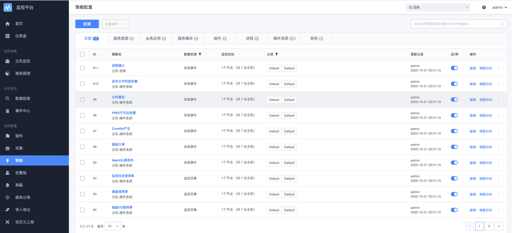
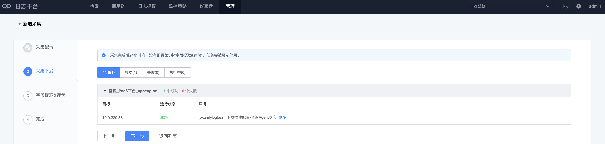
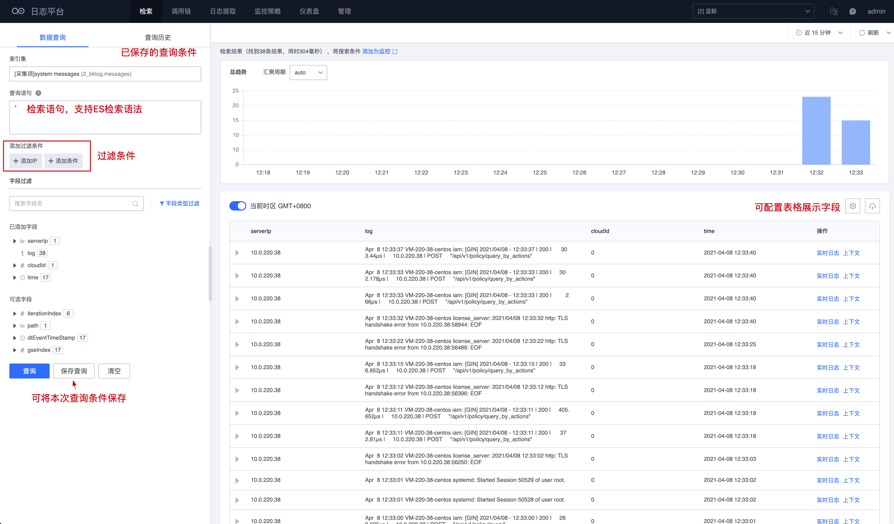
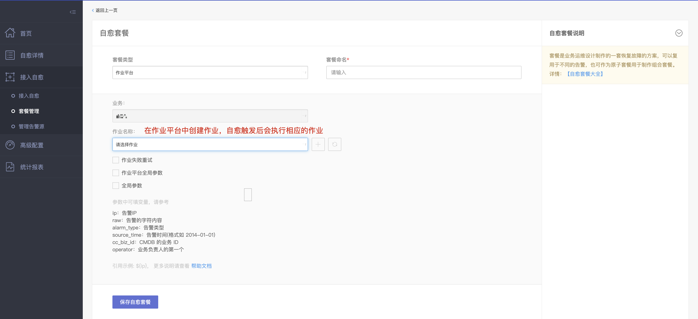

# 监控日志套餐快速入门

​在[基础套餐](quick-start-v6.0-base.md)的快速入门中，我们已经掌握了利用平台能力实现运维自动化，无论您的服务器是几百，几千，几万，甚至几十万，都可以轻松进行管控。在实现了自动化之后，将极大地释放运维繁重的重复操作任务，使其能够更关注业务，为业务创造更多价值。

在持续运维的过程中，我们需要监控预警告警，需要日志排查分析问题。通过不断总结、沉淀经验，甚至可以实现故障的自动修复。

接下来，我们来快速了解监控日志套餐的强大功能。

> 如还未部署【监控日志套餐】，请参考[监控日志套餐部署指引](../../DeploymentGuides/7.0/install-co-suite.md)

在部署好监控日志套餐后，即可在`应用列表`页看到`监控平台` `日志平台` `故障自愈` 这 3 个平台，如下图所示。

### 一、【监控平台】监控告警配置

通过【节点管理】安装 Agent 之后，默认即可使用主机监控功能。

#### 1、监控平台首页

​监控平台首页，相关功能如图所示，分为`左侧菜单`，`图表展示`和`业务切换`等几个功能区域。

#### 2、主机监控

主机监控是监控产品的核心功能之一，无需繁琐的配置，在 Agent 安装后，即可采集到完整的操作系统主机相关指标，如下图所示。

#### 3、主机监控视图

从主机列表上，点击主机 IP，可查看详情，如下图所示。其中左侧的主机列表，来源于 CMDB 中配置的业务拓扑，业务拓扑配置请参考[CMDB 创建业务拓扑](quick-start-v7.0-base.md#2、创建业务拓扑)。

主机在 CMDB 中配置了进程端口数据，则监控会展示该主机的进程端口运行情况，如下图所示。

​除了在主机监控中可查看视图外，还可以在`仪表盘`对各类数据进行展示，实现一屏显示所有关键图表数据的效果，如下图所示。

#### 4、告警策略配置

​监控的重要功能之一是发送告警，通过配置监控策略，触发阈值即可发送告警出来，默认策略如下图所示。注意，策略是默认自带的，当主机扩容后，策略 Hi 自动匹配新增的主机目标，无需人工修改策略。

​告警发送，默认是具有收敛功能，可以基于主机，基于策略窗口等方式进行收敛，将告警事件有效聚合，避免产生”告警风暴“，为您的提供更有效的告警信息。

#### 5、事件中心

​在告警产生、发送后，可通过`事件中心`查看告警信息，如下图所示。

#### 6、告警屏蔽

当告警属于已知问题、无关紧要问题、或者常规的业务变更等情况，可对告警按需进行屏蔽，如下图所示。

#### 7、更多功能

体验到此，相信您已经掌握了`监控平台`的基本使用，如主机监控，查看视图，配置告警，告警屏蔽等，除此之外，监控平台还提供了以下更多的功能。

- 灵活的自定义脚本采集
- 日志关键字监控
- JMX 支持 java 程序监控
- 兼容 Prometheus 的 Exporter 数据采集
- 兼容 Datadog Agent 的数据采集
- 可编程上报监控数据，支持 HTTP，命令行上报数据
- 支持日志平台数据源接入
- 服务拨测、网站监控
- 动态进程监控

更多`监控平台`的功能探索，可参考[监控平台产品白皮书](../../Monitor/3.6/UserGuide/Overview/README.md)。

### 二、【日志平台】日志检索

> ​如果说监控是运维的千里眼，那么日志就是运维的诊断器，有了日志，运维能精准的定位各种疑难杂症，是故采集分析日志，是运维能够更好服务团队的重要能力。在实际的运维过程中，经常会有开发找运维查询各种日志，分析线上服务运行的报错等异常情况，运维会这种琐事被打断，那么，日志平台将为您解决这种烦恼。

`日志平台`可以快速接入日志，与`ELK`日志套件相比，具有入门容易，配置简单，接入成本低等特点，并且可与监控平台对接配置告警。相比`ELK`，可以无需关心采集端的部署配置，无需关心数据清洗，而相同点是存储都是有 Elasticsearch。

​下面，我们将采集操作系统的`/var/log/messages` ，来演示日志如何接入:

#### 1、日志平台功能概览 

日志平台的使用分三步，第一步接入日志，第二步使用日志，第三步按需配置日志告警。首次进入系统，界面如下图所示。

#### 2、接入日志 

​点击菜单 `管理->数据接入->采集接入-新建` ，如下图所示

​配置日志采集，输入名称，日志类型，采集目标，采集路径等信息，如下图所示。

填写日志采集信息和选择采集目标后，如下图所示

​下发采集配置(如未安装日志采集器，则需要到节点管理安装采集器`bkunifylogbeat`)，如下图所示

​配置 ES 存储、索引名称，存储周期等，可根据实际存储周期要求配置，图下图所示

采集配置完成后，日志会自动入库 ES，接下来就可以进行检索日志，如下图所示

#### 3、检索日志

检索采集的日志，如下图所示。

​检索出的日志如下图所示

至此，我们很快完成了一个日志采集和检索的场景。如需对日志错误、关键字等进行告警，则可通过监控平台添加告警策略。此处由于篇幅关系不再详细演示，更多日志平台功能详见：[日志平台产品白皮书](../../LogSearch/4.3/UserGuide/intro/README.md)。

### 三、【故障自愈】故障自动处理

> 监控建好了，日志也建设了，运维工作将变得越来越轻松。接下来，我们可以玩一些更高级的用法，通过故障自愈实现故障自动修复故障。

#### 1、故障自愈的权限

​故障自愈由于当前版没有接入权限中心，需要在 CMDB 中配置对应业务的运维人员，admin 账号默认具有`蓝鲸`业务权限。

#### 2、开启监控平台告警源

​监控平台的告警策略，都可以接入故障自愈中，默认已开启告警源`监控平台(社区版6.0)` 和`蓝鲸监控(社区版5.0版)` ，如下图所示

​点开`监控平台`告警源，`刷新告警类型`，即可同步`监控平台`的告警策略，如下图所示

同步后的告警策略如下图所示

#### 3、接入自愈

​创建自愈，选择`告警类型` 的告警策略，在产生告警事件后，就会调用`自愈套餐`执行相应的动作，从而实现告警和自动化运维系统打通的闭环场景，如下图所示

#### 4、自愈套餐

`自愈套餐`，是告警事件后需要去处理的任务，可以调用`作业平台`，`标准运维`，`CMDB`等多个产品，

如下图所示

在我们实现了运维自动化之后，对于故障处理的自动化，仍有很大的探索空间，自愈实现了故障自动修复，减少了运维重复的故障处理操作，让我们的运维工作更高效，更专业。

通过以上的快速入门，相信您已经熟悉了监控平台、日志平台、故障自愈这 3 个组合产品的使用，这 3 个产品互相之间紧密关联，同时产品功能上也支持丰富的扩展能力，无论是多么复杂的场景，都可以应对自如，

通过自定义扩展，将更加适合您的个性化场景需求，极大提高运维生产力。