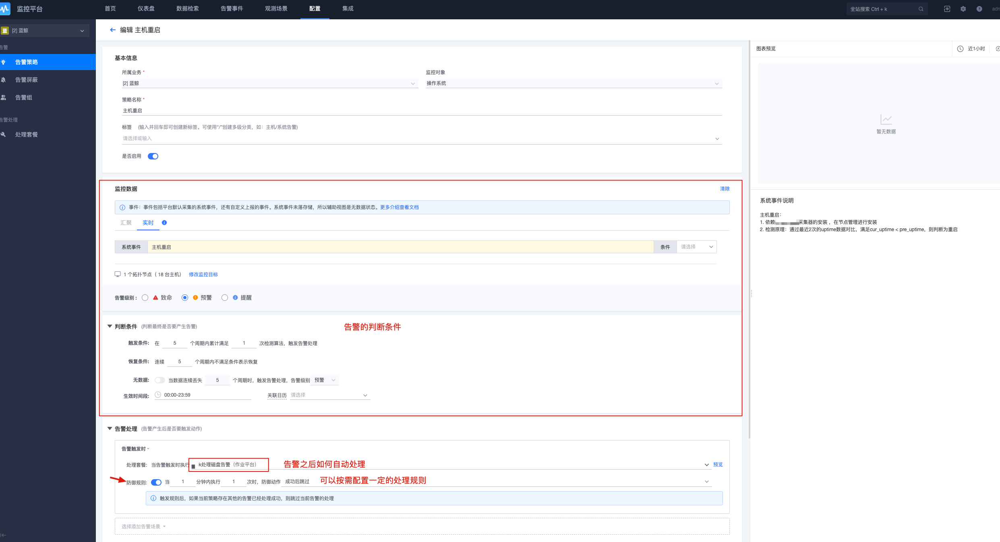

# 监控日志套餐快速入门

在[基础套餐](../../QuickStart/7.0/quick-start-v7.0-base.md)的快速入门中，我们已经掌握了使用平台能力实现运维自动化，无论您的服务器是几百，几千，几万，甚至几十万，都能轻松进行管控。在实现了自动化之后，将极大地释放运维繁重的重复操作任务，我们就会为业务创造更多价值。

在持续运维的过程中，我们需要监控预警告警，需要日志排查分析问题。通过不断总结、沉淀经验，甚至可以实现故障的自动修复。

接下来，我们来快速了解监控日志套餐的强大功能。

> 如还未部署【监控日志套餐】，请参考[监控日志套餐部署指引](../../DeploymentGuides/7.1/install-co-suite.md)

在部署好监控日志套餐后，即可在 `应用列表`页看到 `监控平台` `日志平台`  这 2 个平台，如下图所示。

### 一、【监控平台】监控告警配置

通过【节点管理】安装 Agent 之后，默认即可使用主机监控功能。

#### 1、监控平台首页

监控平台打开后的界面，如图所示，分为 `首页`，`仪表盘 `， `数据检索`，`告警时间`，`观测场景`，`配置` 和 `集成`等几个功能区域。

#### 2、主机监控

主机监控是监控产品的核心功能之一，无需繁琐的配置，在 Agent 安装后，即可采集到完整的操作系统主机相关指标，如下图所示。

#### 3、主机监控视图

从主机列表上，点击主机 IP，可查看详情，如下图所示。其中左侧的主机列表，来源于 CMDB 中配置的业务拓扑，业务拓扑配置请参考[CMDB 创建业务拓扑](../../QuickStart/7.0/quick-start-v7.0-base.md###2、创建业务拓扑)。

主机在 CMDB 中配置了进程端口数据，则监控会展示该主机的进程端口运行情况，如下图所示。

除了在主机监控中可查看视图外，还可以在 `仪表盘`对各类数据进行展示，实现一屏显示所有关键图表数据的效果，如下图所示。

#### 4、告警策略配置

监控的重要功能之一是发送告警，通过配置监控策略，触发阈值即可发送告警出来，默认策略如下图所示。注意，策略是默认自带的，当主机扩容后，策略自动匹配新增的主机目标，无需人工修改策略。

告警发送，默认是具有收敛功能，可以基于主机，基于策略窗口等方式进行收敛，将告警事件有效聚合，避免产生”告警风暴“，为您的提供更有效的告警信息。

#### 5、事件中心

在告警产生、发送后，可通过 `事件中心`查看告警信息，如下图所示。

#### 6、告警屏蔽

当告警属于已知问题、无关紧要问题、或者常规的业务变更等情况，可对告警按需进行屏蔽，如下图所示。

#### 7、更多功能

体验到此，相信您已经掌握了 `监控平台`的基本使用，如主机监控，查看视图，配置告警，告警屏蔽等。对于更多的监控功能，比如kubernets容器监控，应用性能APM监控，本次版本已提供beat版本，您可以去探索使用。

除此之外，监控平台还提供了以下更多的功能。

- 灵活的自定义脚本采集
- 兼容 Prometheus 的 Exporter 数据采集
- 支持Prometheus的SDK主动上报
- 支持 HTTP上报监控数据
- 支持对Java程序的JMX协议监控
- 兼容 Datadog Agent 的数据采集
- 支持日志平台数据源接入
- 日志关键字监控
- 服务拨测、网站监控
- 动态进程监控
- 其他更多功能等您来发现

更多 `监控平台`的功能探索，可参考[监控平台产品白皮书](../../Monitor/3.8/UserGuide/Overview/README.md)。

### 二、【日志平台】日志检索

> 如果说监控是运维的千里眼，那么日志就是运维的诊断器，有了日志，运维能精准的定位各种疑难杂症，是故采集分析日志，是运维能够更好服务团队的重要能力。在实际的运维过程中，经常会有开发找运维查询各种日志，分析线上服务运行的报错等异常情况，运维会这种琐事被打断，那么，日志平台将为您解决这种烦恼。

`日志平台`可以快速接入日志，与 `ELK`日志套件相比，具有入门容易，配置简单，接入成本低等特点，并且可与监控平台对接配置告警。相比 `ELK`，可以无需关心采集端的部署配置，无需关心数据清洗，而相同点是存储都是有 Elasticsearch。

下面，我们将采集操作系统的 `/var/log/messages` ，来演示日志如何接入:

#### 1、日志平台功能概览

日志平台的使用分三步，第一步接入日志，第二步使用日志，第三步按需配置日志告警。首次进入系统，界面如下图所示。

#### 2、接入日志

点击菜单 `管理->日志采集-新建`采集项，如下图所示。

配置日志采集，输入名称，日志类型，采集目标，采集路径等信息，如下图所示。

填写日志采集信息和选择采集目标后，如下图所示。

下发采集配置(如未安装日志采集器，则需要到节点管理安装采集器 `bkunifylogbeat`)，如下图所示。

字段清洗，支持对日志格式进行处理。

配置 ES 存储、索引名称，存储周期等，可根据实际存储周期要求配置，图下图所示。

采集配置完成后，日志会自动入库 ES，接下来就可以进行检索日志，如下图所示。

#### 3、检索日志

检索采集的日志，如下图所示。

可以对检索显示的字段以及样式进行调整。

至此，我们很快完成了一个日志采集和检索的场景。如需对日志错误、关键字等进行告警，则可通过监控平台添加告警策略。此处由于篇幅关系不再详细演示，更多日志平台功能详见：[日志平台产品白皮书](../../LogSearch/4.6/UserGuide/Intro/README.md)。

### 三、【故障自愈】故障自动处理

> 在7.0版本中，我们对故障自愈功能进行了全新的升级，使用更加容易。自愈与监控深度融合，更快捷的实现无人值守的故障自动修复，提高业务的可用性和故障的及时修复能力。

自愈的使用非常简单，步骤分为3步：1.配置处理套餐(具体的告警处理动作) 2.在告警策略中使用处理套餐(告警后使用对应的处理套餐) 3.告警产生的时候，自动执行处理套餐。

#### 1、创建处理套餐

首先，我们来创建一个处理套餐，如下图所示。

套餐类型支持HTTP回调、作业平台、标准运维、流程服务、标准运维公共流程，通过多种组合，可以灵活应对各种告警处理需求，几乎可以覆盖所有的运维告警处理需求。

#### 2、创建策略使用套餐

接着，我们来到策略中使用处理套餐。与上个版本的监控相比，告警策略，增加了告警处理的功能，也就是故障自愈的功能。在告警策略中配置处理套餐，如下图所示。

在告警处理中，支持对告警的不同情况，分别配置不同的处理套餐。

对于不同场景的故障处理的自动化，需要我们不断累积业务经验和应对方案，通过自愈去自动修复，可减少了运维重复的故障处理操作，让我们的运维工作更高效，更专业。

通过以上的快速入门，相信您已经熟悉了监控平台、日志平台，除了开箱即用的常见功能，平台还提供了丰富的扩展能力，并且平台间均是互相关联，通过自定义扩展，将更加适合您的个性化场景需求，极大提高运维生产力。
