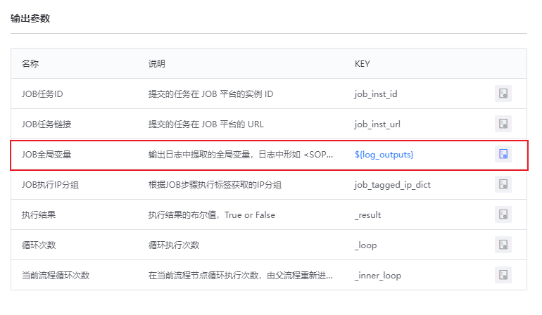

# 如何实现在不同步骤间传递参数

当我们的流程有多个步骤时，经常需要把某个步骤处理的结果值传递给下一个或后面的步骤使用；
这里详细介绍利用作业平台插件配合标准运维的标准运维的标记符号实现此功能


### 1. 使用作业平台的插件“快速执行脚本”或“执行作业”

在脚本里使用标准运维的标记符号"<SOPS_VAR></SOPS_VAR>"，将要传递的数据以key/value对的形式包含在标记符号中，并使用echo/print等打印到作业平台的日志中

例如图中，打印了一个key/value存储在"<SOPS_VAR></SOPS_VAR>"中间 ，key为message，value为 “hello world”

```
message="hello world"
echo "<SOPS_VAR>message:$message</SOPS_VAR>"
```

标准运维执行到该节点时，会匹配标记符号，提取作业平台日志中的数据，并存储到输出参数${log_outputs}中


### 2. 将输出参数“JOB全局变量”设置为变量，后续步骤才能使用  



### 3. 和访问dict类似，使用${log_outputs["message"]}，访问脚本中定义的数据


### 4. 一点限制和技巧

```
目前标记符号为：<SOPS_VAR>message:xxxxxxx</SOPS_VAR>

其中的value不支持换行。如果需要在后续引用换行的格式，可以通过其他符号标记，在后续变量引用中，使用python的替换语法使用。

举例1：
变量为： <SOPS_VAR>message:123|456|789</SOPS_VAR>

引用时用换行替换竖线：${'\n'.join(log_outputs_xxxx['message'].split('|'))}

变量执行时，值为：

123

456

789

举例2：
变量为：<SOPS_VAR>message:1.1.1.1@name1|2.2.2.2@name2|3.3.3.3@name3</SOPS_VAR>

引用时，先用空格替换@，再用换行替换竖线：${'\n'.join(' '.join(log_outputs_xxxx['message'].split('@')).split('|'))}

变量执行时，值为：

1.1.1.1 name1
2.2.2.2 name2
3.3.3.3 name3
```

