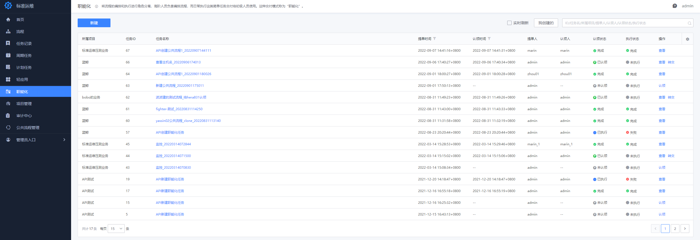
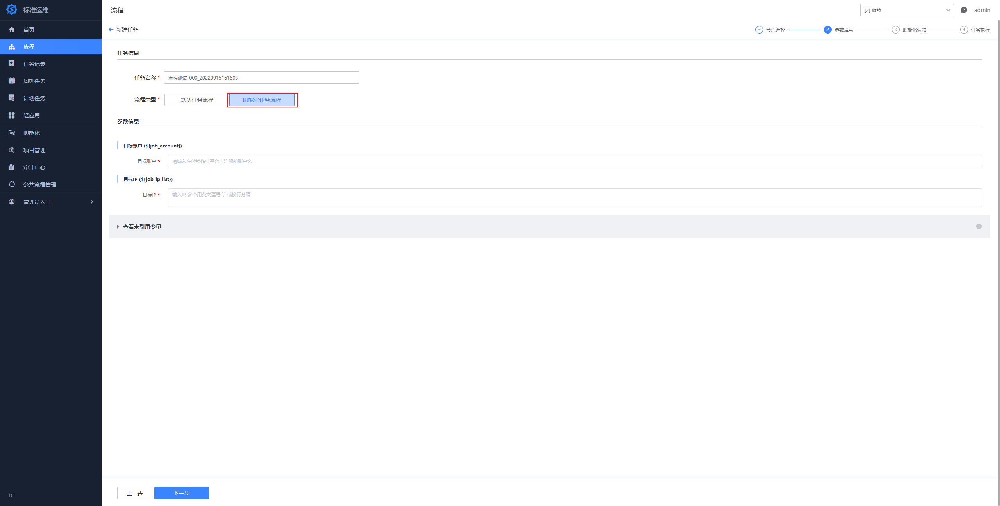

## 职能化

职能化中心可以让拥有流程管理权限的人员，通过设置“执行代理人”功能，将流程任务的执行操作交由第三方人员（如：外包、外聘人员），帮助流程管理人员从繁重的执行工作中解放。用户需要拥有“职能化中心查看”的权限，才能够进入职能化中心页面：

### 如何创建职能化任务

当我们使用流程创建任务时，在参数填写界面能够选择“流程类型”，将任务类型修改为“职能化任务流程”，在参数填写完成后该任务就会以“待认领”的状态进入到职能化中心中等待认领，已认领的任务也可转交给他人。

当然，职能化人员也可以在职能化页面主动创建任务（需要拥有“流程查看”和“流程新建任务”权限）：

