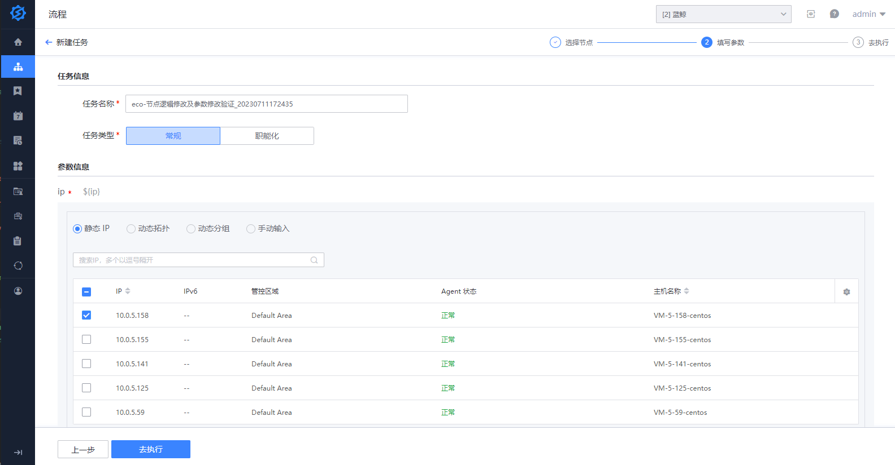
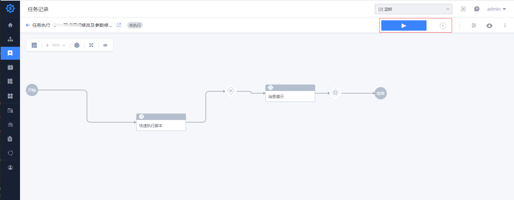
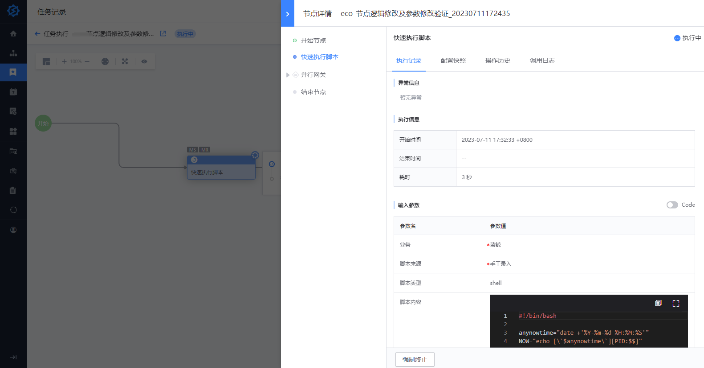
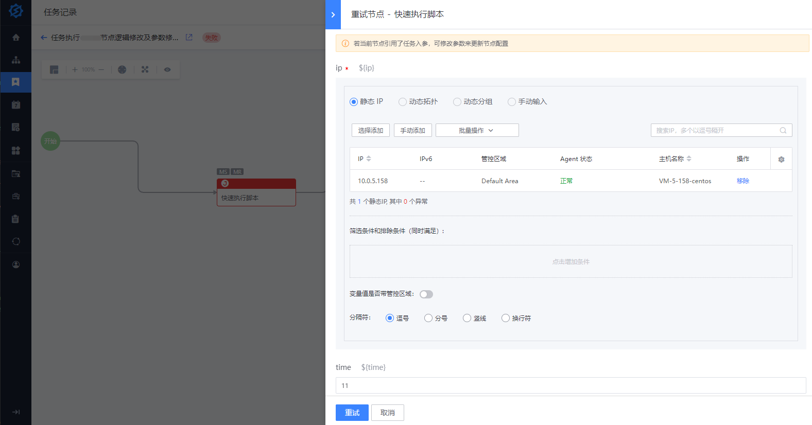
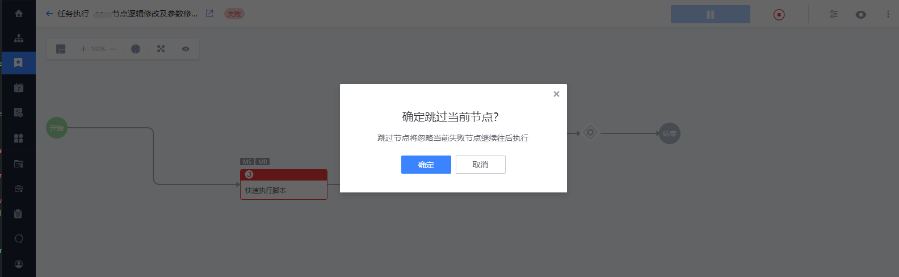

# 新建任务

流程只是一个模板，我们需要实例化流程，这就会产生一个任务。用户可点击流程的 “新建任务” 按钮创建一个任务

### 操作步骤：**选择节点 - 填写参数 - 操作任务**

1. 选择节点，默认为全选所有节点
   - 手动勾选
   - 选择已创建的执行方案
   - 使用一次性方案

> 节点配置时可设置节点 "是否可选"，

2. 填写参数

3. 任务执行时，可以对任务和节点执行各种操作

   - 启动 、暂停、终止

   

   - 查看、修改任务入参

   

   - 查看节点执行详情
     

   - 对失败节点进行“重试”或“跳过”操作
     > 重试时仅允许修改任务的入参

   

   
