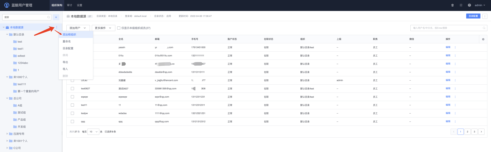
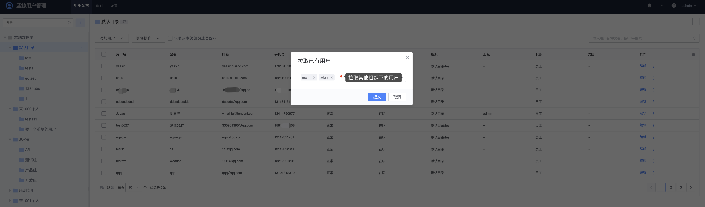

# 组织架构

组织架构是人员管理的组织形式，支持多层级组织，组织架构根据所属用户目录的类型表现形式有差异。

- OpenLDAP、MAD 用户目录，组织架构默认只读，管理员无法编辑；
- 本地用户目录，组织架构可以编辑。

本文重点讲`本地用户目录`类型的组织架构和用户信息管理。

## 添加组织

添加组织的前提，必须是存在可编辑的用户目录类型（这里指本地用户目录）。

选择需要添加组织的用户目录，点击`更多`的 icon，弹出面板（如下图），可以进行组织的添加，一个用户目录支持多个组织的添加。

## 组织添加用户

组织添加用户可以有几种方式：`新增用户、批量新用户导入、从已有组织拉取`，前两者是新增用户，后者是为了实现一个用户跨多个组织。

### 新增用户

点击需要添加用户的组织，右侧点击`添加用户 -> 新增用户`，在弹出的滑窗里填写用户详细信息，点击`保存`成功添加新用户，新增的用户默认会显示在表格首行。

### 拉取已有用户

点击需要添加用户的组织，右侧点击`添加用户 -> 拉取已有用户`，在弹出的输入框里，输入具体需要添加的用户名，点击提交进行批量添加。

### 批量导入用户

在**组织架构**页面，找到本地用户目录，点击右侧的更多，弹出的面板点击“导入”，下载对应导入模板，模板里红色字体为必填项。

填写好用户信息后再导入即可完成批量用户新增。

## 管理用户

 点击需要管理的用户，在弹出的滑窗里，可以对该用户进行`编辑`、`禁用`、`删除`、`重置密码`这些操作。

- 编辑：编辑用户基本信息
- 禁用：用户禁用后将无法进行登录操作，接触禁用可以继续登录
- 删除：用户删除后将进入回收站，后续版本支持从回收站恢复被删除用户
- 重置密码：管理员可以帮用户重置登录密码

