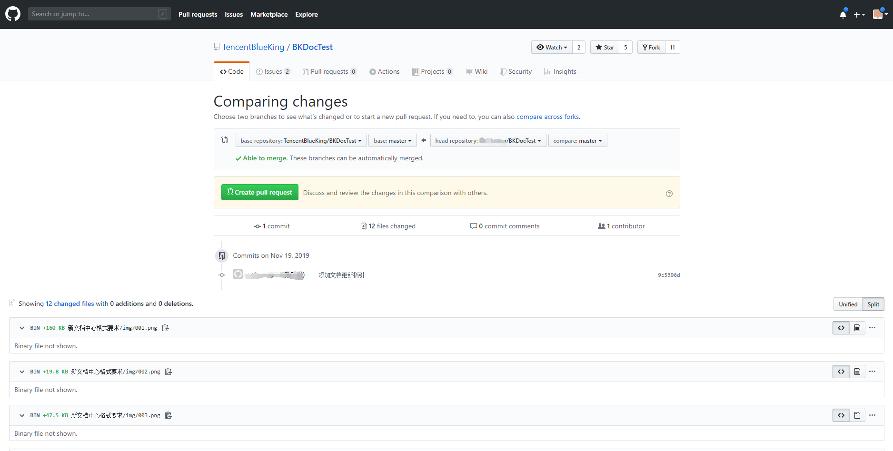

# 更新或者上传文档帮助

- 背景说明：因为文档中心从之前的不同仓库合并到一个仓库，所以在文档更新维护上存在一定差异。此文档会详细说明项目工作流、以及文档结构的变化，并给出示例以供参考。

- 本文组成：该帮助文档由两部分组成：文档更新方式、和文档规范，编写文档时请务必遵循。

> 注：当前目录下的 [蓝鲸官网文档管理系统准则](蓝鲸官网文档管理系统准则.md) 是文档内容格式的规范，请务必查看。

##  一：文档更新方式

- 现在文档的更新入口已经移到 GitHub ，GitLab 的更新入口已经关闭，如果要更新文档请到  [蓝鲸文档中心 GitHub](https://github.com/TencentBlueKing/BKDocTest )。

## 二：文档的规范
### 文档目录结构规范

目前 文档仓库目录结构大体如下所示：

```
BlueKingDocsTest
|-- README.md
|-- 新文档须知
|   |-- README.md
|-- ZH
|   |
|	|-- 5.1
|   |	|-- PaaS
|   |	|-- 日志检索
|   |	|-- ...
|   |-- 5.0
|   |   |-- PaaS
|   |   |-- 日志检索
|   |	|-- ...
|-- EN
|	|-- 5.1
|   |	|-- PaaS
|   |	|-- 日志检索
|   |	|-- ...
|   |-- 5.0
|   |   |-- PaaS
|   |   |-- 日志检索
|   |	|-- ...
```

- 其中 ZH 下为中文文档，EN 下为英文文档。

- ZH 之下的 5.1 和 5.0 代表版本，其中 5.1 下对应的是社区版 5.1 的文档。

- 目前文档中心暂时只有社区版 5.1 的中文文档，后续会继续补充其它版本以及英文文档。

在每一篇文档的目录下，根据该文档的章节创建章节目录，每一个章节的md需要放在对应目录下。其中 assets 用于存放该文档的图片目录。



### 文档的 SUMMARY 文件规范

以 PaaS 的 SUMMARY.md 为例

```
# Summary
## PaaS平台白皮书
* [产品简介](产品简介/README.md)
* [术语解释](术语解释/Term.md)
* [产品架构](产品架构图/Architecture.md)
* [产品功能]()
    * [三个环境（本地开发环境，测试环境，正式环境）](产品功能/ThreeEnvironment.md)
    * [基本账号体系](产品功能/AccountSystem.md)
    * [基本角色管理](产品功能/RoleManagement.md)
    * [Web 安全防护](产品功能/WebSafetyProtection.md)
    * [个人工作台](产品功能/PersonalWorkbench.md)
    * [可插拔式应用](产品功能/PluggableApplications.md)
    * [开发框架](产品功能/DevelopmentFramework.md)
    * [企业服务总线（ESB和API Gateway）](产品功能/EnterpriseServiceBus.md)
    * [基于 virtualenv 的应用部署](产品功能/ApplicationDeployment.md)
    * [MagicBox](产品功能/MagicBox.md)
    * [部署操作记录展示](产品功能/DeploymentRecord.md)
    * [线上基础开发培训](产品功能/DeploymentTrain.md)
    * [个人定制桌面](产品功能/CustomizedDesktop.md)
    * [开发框架增值模块（功能开关、权限控制等）](产品功能/FrameworkAppreciationModule.md)
    * [可扩展的应用变量](产品功能/ExtensionVariable.md)
    * [日志可视化管理](产品功能/LogVisualizaManagement.md)
    * [后台任务可视化管理](产品功能/BackgroundVisualizaManagement.md)
    * [功能函数可视化管理](产品功能/FunctionsVisualizaManagement.md)
    * [组件访问权限控制](产品功能/ComponentAccessControl.md)
    * [ESB健康度报告](产品功能/ESBHealthReport.md)
    * [应用数据库托管服务](产品功能/DatabaseHosting.md)
    * [应用监控告警](产品功能/MonitoringAlarm.md)
    * [应用运营数据统计](产品功能/OperatingStatistics.md)
    * [其他高级功能](产品功能/AdvancedFeature.md)
* [快速入门]()
    * [使用蓝鲸的某个 SaaS](快速入门/UsingSaaS.md)
    * [开发一个 APP](快速入门/DevelopAPP.md)
* [场景案例]()
    * [如何将蓝鲸S-mart上的SaaS部署起来？](场景案例/SaaSDeployment.md)
    * [如何使用蓝鲸 MagicBox 拖拽一个前端界面？](场景案例/MagicBox.md)
    * [如何将第三方系统放在蓝鲸桌面/工作台中使用？](场景案例/ThirdParty.md)
    * [如何配置通知渠道，如邮件、微信、短信等？](场景案例/noticeWay.md)
    * [部署应用过程中，状态一直在“正在提测”中，如何处理？](场景案例/Loading.md)
    * [如何给某一个SaaS开组件“免用户认证”的白名单？](场景案例/White.md)
* [SaaS开发](SaaS开发/SaaSDev.md)
* [二次开发](二次开发/Extend.md)
* [API文档](API文档/APIdoc.md)
* [常见问题](常见问题/FAQ.md)
```

SUMMARY.md 需要遵循以下规范：

- 缩进使用四个空格

- 文章的目录层级最小到四级，该文档只到两级。

- 若是该章节下还有小章节，则该章节无需对应的md文件，如产品功能 `* [产品功能]() `(其中的括号不能省略)，因为该章节下有小节，所以产品功能不能有对应的md文件，若该章节有章节的概述内容，请在下方添加一小节概述来展示。

- 在 SUMMARY.md 中的每一节都应该对应一个 markdown 文件，不能多节内容对应一个md文件。错误示例：

  ```
  * [快速入门]()
    * [使用蓝鲸的某个 SaaS](快速入门/GUIDE.md#UsingSaaS)
    * [开发一个 APP](快速入门/GUIDE.md#DevelopAPP)
  ```

  其中有两节共用一个 GUIDE.md ，应该拆分为两个 md 文件，一节对应一个。


### 文章内容编写规范

- 详见 [蓝鲸官网文档管理系统准则](蓝鲸官网文档管理系统准则.md)

### 白皮书章节要求：

必须包含以下几部分：
- 产品简介
- 术语解释
- 产品架构图
- 产品功能
- 快速入门
- 场景案例
- 常见问题

具体章节内容可以参考：https://docs.qq.com/sheet/DS0pQbHpxQU9zcmVz?preview_token=&t=1565163497869&coord=I64A0AW0&tab=k4rd85&c=F13A0J0

### 图片或者 markdown 文件规范：

- 注意文档所有的目录名或者文件名不能出现符号：`-` ，若已有请替换成 `_` 。

- 图片文件全部放置于该文档目录的 assets 或 media 目录下，应用使用相对路径引用。如:``

- 单个md文件的内容不要超过 1.5 万个汉字，若是超过请分成多节。

### 内容格式规范：

[蓝鲸官网文档管理系统准则](./蓝鲸官网文档管理系统准则.md)

### 文档的引用以及文档链接帮助

#### 文档的引用

以管控平台的 SUMMARY.md 为例介绍文档引用的效果和方法。

```bash
# Summary

## 管控平台

* [产品简介](产品简介/README.md)
* [术语解释](术语解释/Term.md)
* [产品架构图](产品架构图/Architecture.md)
* [支持 OS 类型](支持OS类型/OsSupport.md)
* [产品功能]()
    * [文件传输](产品功能/FileTrans.md)
    * [实时任务执行](产品功能/RealTimeExecute.md)
    * [数据采集与传输](产品功能/DataCollect.md)
    * [集群管理](产品功能/ClusterManage.md)
* [API 文档]()
    * [简介](5.1/API文档/GSE/README.md)
    * [Agent心跳信息查询](5.1/API文档/GSE/get_agent_info.md)
    * [Agent在线状态查询](5.1/API文档/GSE/get_agent_status.md)
* [常见问题](常见问题/FAQ.md)
```

在管控平台的 SUMMARY.md 中， API 文档部分是引用的 API 文档中的部分 md 文件，这样便不用在自己的目录下再去复制一份 API 文档，而且更新起来也只需要更新一份便可。

通过目录引用其他文档内的 md，md 的路径应该是以版本号开头的对应 md 文件的绝对路径 `5.1/API文档/GSE/get_agent_info.md 。`之所以路径不是以 ZH 或者 EN 开头，是因为暂不支持中文文档引用英文文档内容。

最后展示效果如下图:


#### 文档内的链接

有时需要一个链接至另外一篇文档的链接，该怎么实现呢？

文档的相互链接语法示例：`[get_agent_info](5.1/API文档/GSE/get_agent_info.md)`

与目录引用其他文档的 md 一样，也是以版本号开头的路径。
