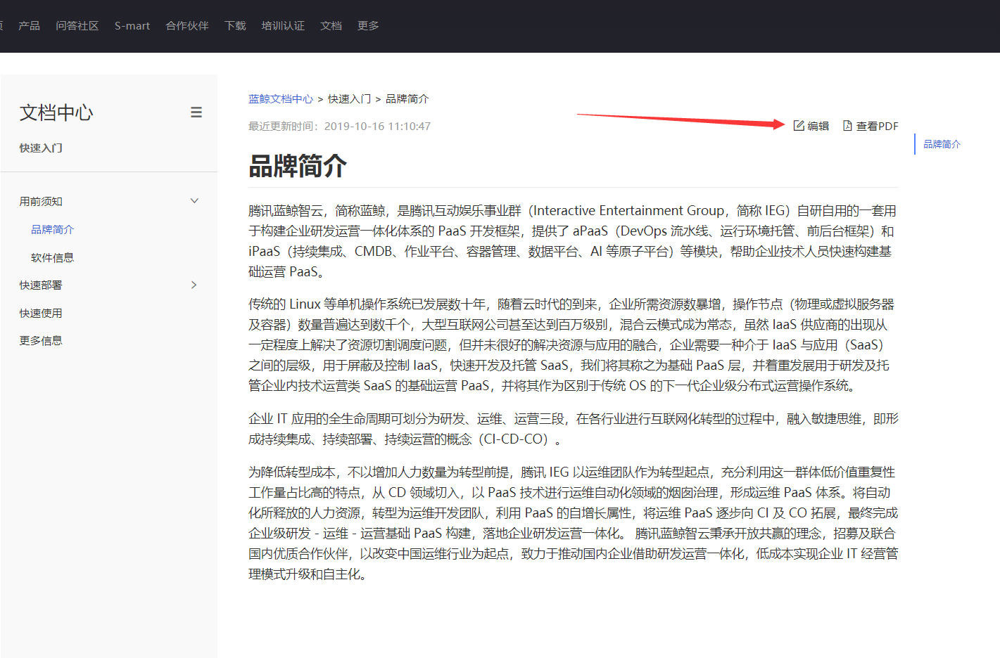
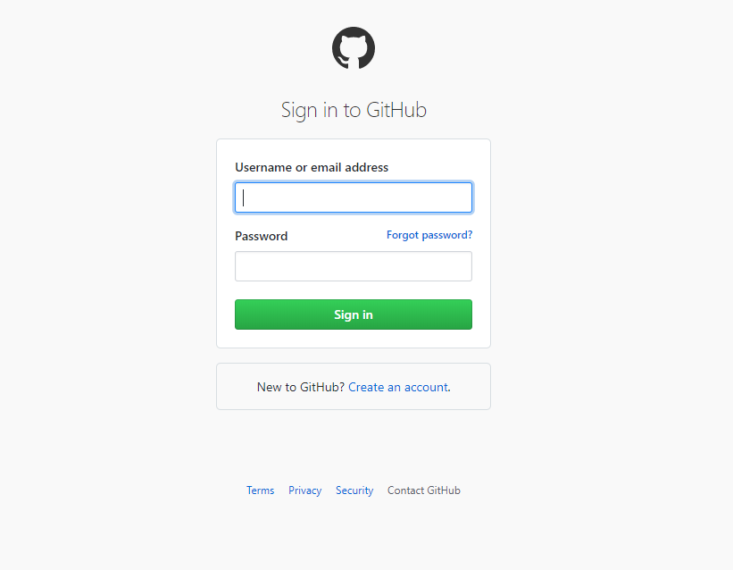
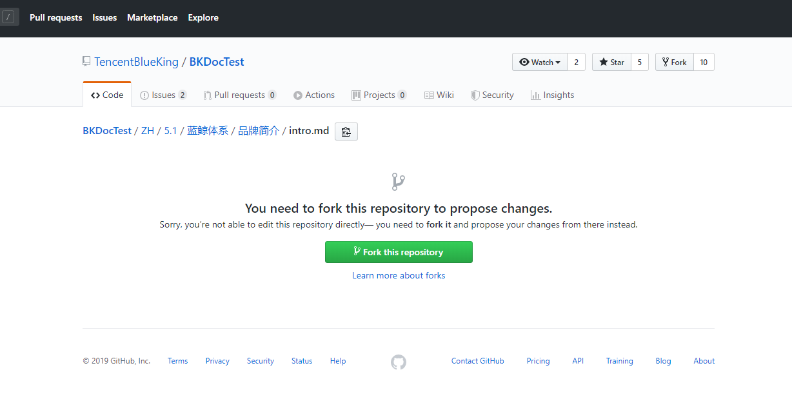
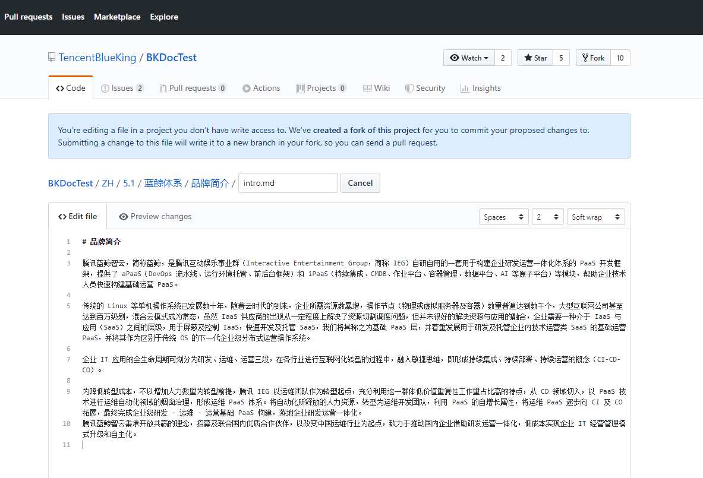
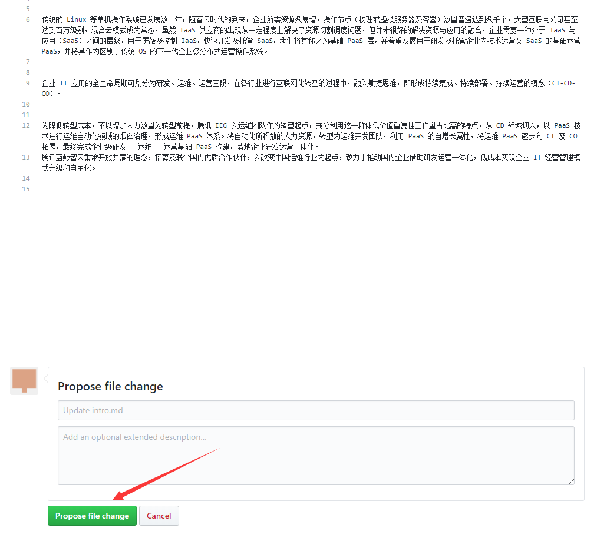
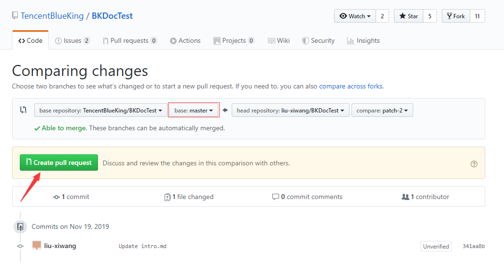
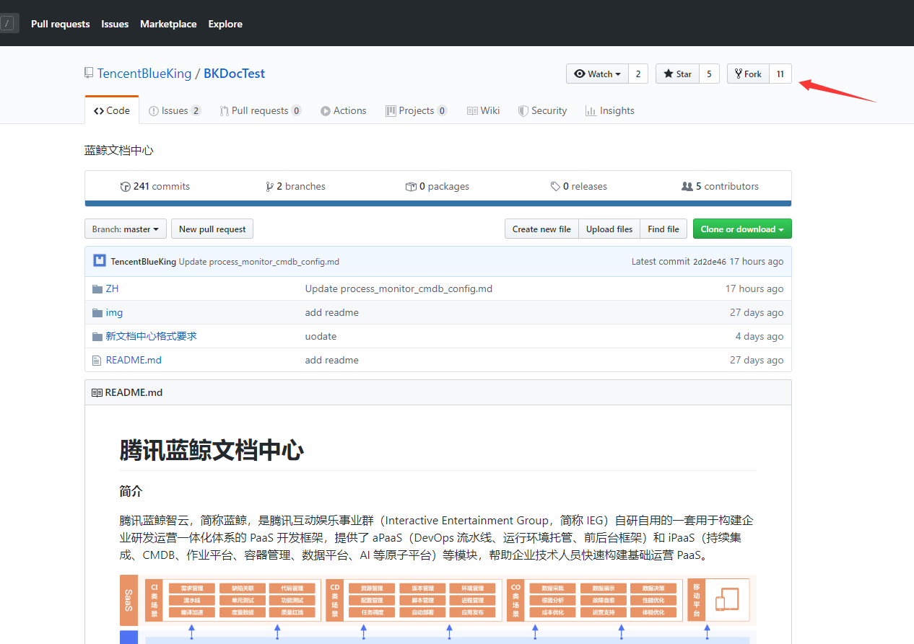
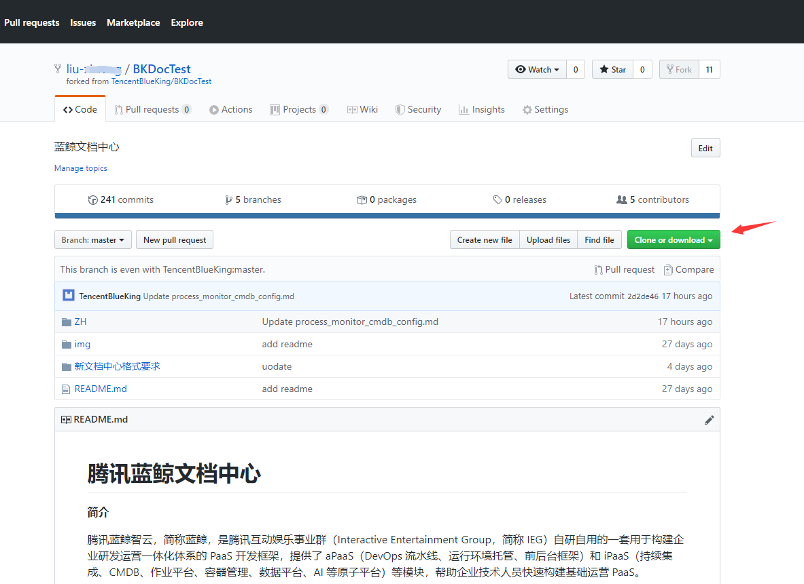
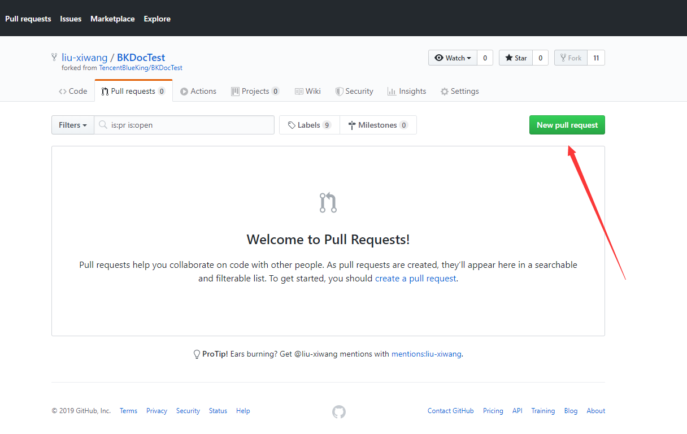

## 更新文档指引

[简单的文字修改](#简单的文字修改)

[需要上传新的图片、MD 文件](#需要上传新的图片、文件)

### 简单的文字修改

在文档中心找到想要修改的文章，点击页面右上角编辑按钮。



之后会跳转到 GitHub，如果没有登录 GitHub 会跳转到登录界面，这时登录就行了。



如果之前没有在 GitHub 修改过蓝鲸的文档，则在修改之前需要 Fork 蓝鲸文档中心的仓库。点击图中的 Fork this repository 即可。



在你 Fork 仓库后就会进到该文档的编辑页了，以后再想修改文档点击修改会直接进入到该文档的编辑界面。



修改后提交你的修改，创建 pull request 。通过我们审核后，你修改的内容便会更新在官网的文档中心。






### 需要上传新的图片、文件

如果修改文档需要上传新的图片，或者新的 md 文档，那么 GitHub 自带的页面编辑器就不再适用了。这时候我们需要把项目 pull 到本地进行修改。

下面是具体步骤：

如果没有 Fork 蓝鲸文档中心的仓库，首先 Fork 该 Git 仓库。[蓝鲸文档中心 GitHub]( https://github.com/TencentBlueKing/BKDocs )



Fork 后，在你的账号下也会出现一个蓝鲸文档中心的项目。再将你自己账号下的蓝鲸文档中心项目 Clone 到本地。



在本地项目你就可以尽情的修改了，再修改之后再将项目 push 到自己账号下的文档仓库。之后便是关键的一步了，创建 Pull requests。



之后提交 pull requests 的操作与前面一样。

审核通过后会将你修改的内容展示到官网文档中心。

**注意：**

如果是再次在本地更新文档，需要在更新前同步官方文档中心仓库的内容。否则提交 pull request 容易发生冲突，导致不能 merge。

同步官方库内容步骤 （以下步骤在本地文档项目下操作 ）：

```bash
# gitbash
# 第一步，添加远程仓库。
git remote add blueking https://github.com/TencentBlueKing/BKDocs.git
# 第二部，同步仓库内容。
git pull blueking master
```
