## 更新或者上传文档帮助

- 背景说明：因为文档中心从之前的不同仓库合并到一个仓库，所以在文档更新维护上存在一定差异。此文档会详细说明项目工作流、以及文档结构的变化，并给出示例以供参考。

- 本文组成：该帮助文档由两部分组成：文档更新方式、和文档规范，编写文档时请务必遵循。

> 注：当前目录下的 [蓝鲸官网文档管理系统准则](蓝鲸官网文档管理系统准则.md) 是文档内容格式的规范，请务必查看。


###  一：文档更新方式： GitLab Fork 工作流
---

因为文档的维护人员较多，各自负责相关部分，为了避免个别失误带来整个仓库的瘫痪，所以采用`Fork+Merge Request`方式提交修改，如果对此不熟悉请仔细阅读该文档，如有疑问请直接联系 v_xiwangliu。

##### 工作流程图解：

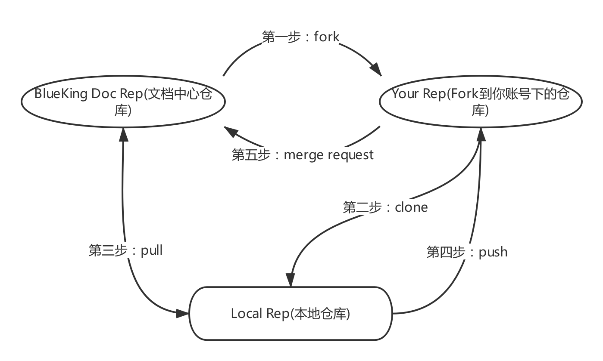


##### 事先准备工作：

- 安装 git，下载地址：https://git-scm.com/downloads

- 申请 gitlab-paas.open.oa.com 账号

    - 审核人：sundytian

- 申请 GitLab 仓库权限

    - 仓库地址：http://gitlab-paas.open.oa.com/herazhang/BlueKingDocsTest.git

    - 审核人：v_xiwangliu，herazhang


- 安装 Node.js ，在命令行输入：`npm install -g gitbook-cli` 安装GitBook，它可以让我们在本地预览文档效果。

    Node.js下载地址 https://nodejs.org/en/#download

    若是因为网络问题npm安装失败，需要使用代理软件，下载地址：
    http://file.tapd.oa.com/qcloud_bk/attachments/download/1010104091002285793/wiki


##### 工作流程详解：

- 第一步：进入文档中心项目首页：http://gitlab-paas.open.oa.com/herazhang/BlueKingDocsTest
    点击Fork，成功后文档项目会出现在你的项目下。

    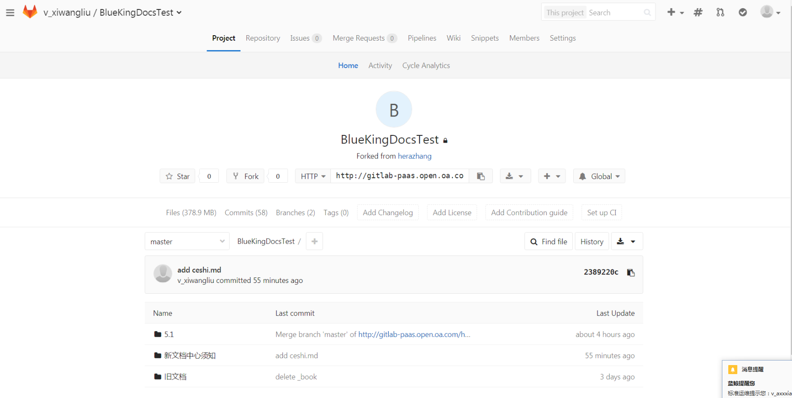

- 第二步：clone自己的文档项目至本地。

    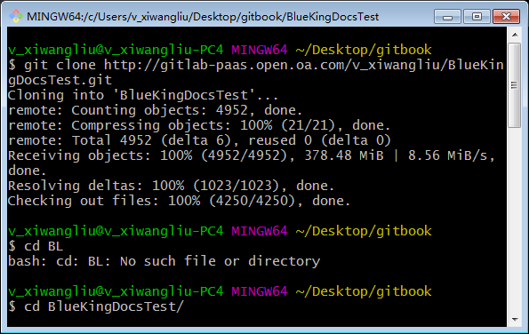

    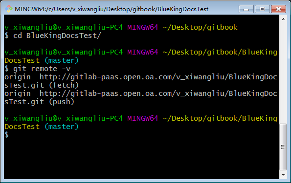

- 第三步：为本地项目添加同步文档中心远程仓库，然后 pull master 分支同步最新的文档。

    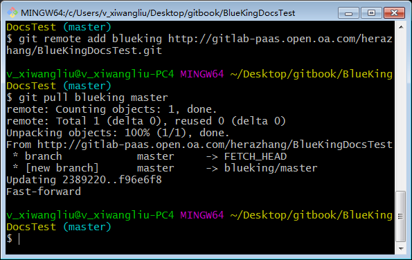

    其中 `blueking` 是别名，可以自己取一个有意义的。

- 第四步：进行文档修改，预览，检测完成后 push 新文档到自己的仓库。

    其中文档修改规则请依照下方文档规范。

    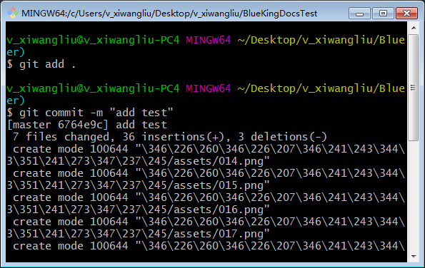

    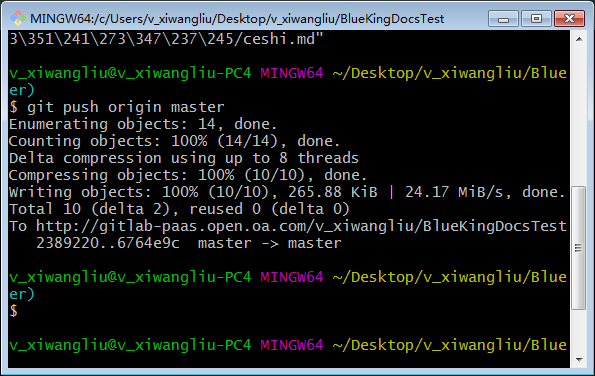

- 第五步：登入自己GitLab仓库，发起merge请求。

  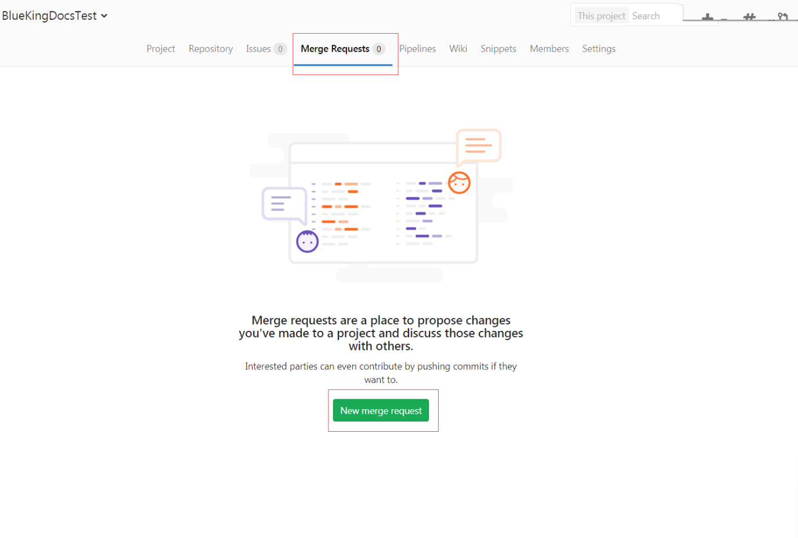

  选择分支

  

  填写相关信息后发起merge请求

  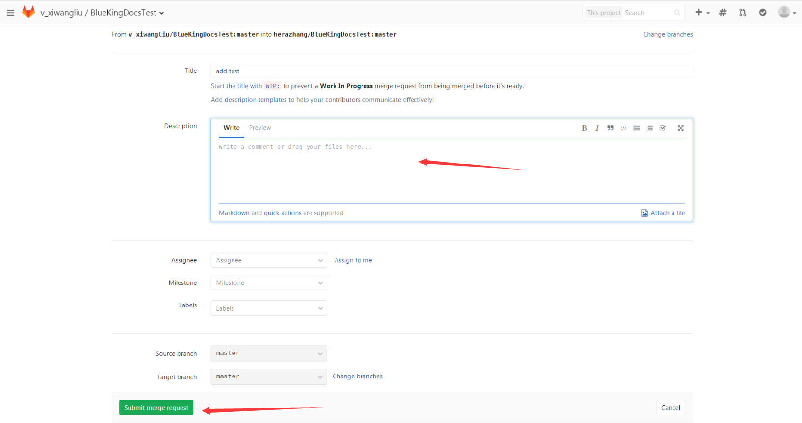

- 第六步：通知审核人员审核，审核变更内容,通过则合并版本


##### 注意

- 上述步骤中：第一步，第二步，第三步的添加同步远程仓库为一次性操作，在第一次设置好即可。而第三步的 pull 和第四步，第五步，第六步的过程是每次更新文档都需要操作的。

- 第三步的 pull 要切记这里应该 pull 的是文档中心的仓库`git pull blueking master`，而不是自己的仓库。


### 二：文档的规范

---

##### 文档目录结构规范

目前 GitLab 仓库目录结构大体如下所示：

```
BlueKingDocsTest
|-- 新文档须知
|   |-- README.md
|-- 5.1
|   |-- PaaS
|   |-- 日志检索
|   |-- ...
|-- 旧文档
|   |-- 标准运维
|   |-- 作业平台
|   |-- ...
```

- 其中5.1目录下是按照新格式编写的文档，符合需求的。

- 新文档须知下是帮助文档，即本文章。

- 旧文档不符合新文档中心规范的文档，还需要进行修改。

项目目录 `BlueKingDocsTest/5.1` 下，每一个目录夹，对应每一篇文档，其中 5.1 代表版本号。

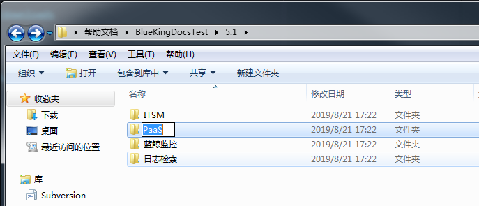


文档目录下，根据该文档的章节创建章节目录，每一个章节的md需要放在对应目录下。其中 assets 用于存放该文档的图片目录。

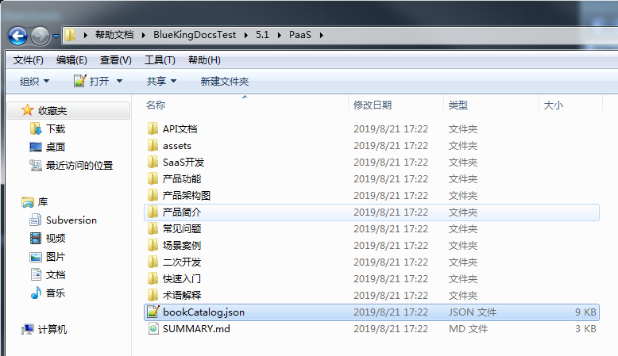

##### 文档的 SUMMARY 文件规范

以 PaaS 的 SUMMARY.md 为例

```
# Summary
## PaaS平台白皮书
* [产品简介](产品简介/README.md)
* [术语解释](术语解释/Term.md)
* [产品架构](产品架构图/Architecture.md)
* [产品功能]()
    * [三个环境（本地开发环境，测试环境，正式环境）](产品功能/ThreeEnvironment.md)
    * [基本账号体系](产品功能/AccountSystem.md)
    * [基本角色管理](产品功能/RoleManagement.md)
    * [Web 安全防护](产品功能/WebSafetyProtection.md)
    * [个人工作台](产品功能/PersonalWorkbench.md)
    * [可插拔式应用](产品功能/PluggableApplications.md)
    * [开发框架](产品功能/DevelopmentFramework.md)
    * [企业服务总线（ESB和API Gateway）](产品功能/EnterpriseServiceBus.md)
    * [基于 virtualenv 的应用部署](产品功能/ApplicationDeployment.md)
    * [MagicBox](产品功能/MagicBox.md)
    * [部署操作记录展示](产品功能/DeploymentRecord.md)
    * [线上基础开发培训](产品功能/DeploymentTrain.md)
    * [个人定制桌面](产品功能/CustomizedDesktop.md)
    * [开发框架增值模块（功能开关、权限控制等）](产品功能/FrameworkAppreciationModule.md)
    * [可扩展的应用变量](产品功能/ExtensionVariable.md)
    * [日志可视化管理](产品功能/LogVisualizaManagement.md)
    * [后台任务可视化管理](产品功能/BackgroundVisualizaManagement.md)
    * [功能函数可视化管理](产品功能/FunctionsVisualizaManagement.md)
    * [组件访问权限控制](产品功能/ComponentAccessControl.md)
    * [ESB健康度报告](产品功能/ESBHealthReport.md)
    * [应用数据库托管服务](产品功能/DatabaseHosting.md)
    * [应用监控告警](产品功能/MonitoringAlarm.md)
    * [应用运营数据统计](产品功能/OperatingStatistics.md)
    * [其他高级功能](产品功能/AdvancedFeature.md)
* [快速入门]()
    * [使用蓝鲸的某个 SaaS](快速入门/UsingSaaS.md)
    * [开发一个 APP](快速入门/DevelopAPP.md)
* [场景案例]()
    * [如何将蓝鲸S-mart上的SaaS部署起来？](场景案例/SaaSDeployment.md)
    * [如何使用蓝鲸 MagicBox 拖拽一个前端界面？](场景案例/MagicBox.md)
    * [如何将第三方系统放在蓝鲸桌面/工作台中使用？](场景案例/ThirdParty.md)
    * [如何配置通知渠道，如邮件、微信、短信等？](场景案例/noticeWay.md)
    * [部署应用过程中，状态一直在“正在提测”中，如何处理？](场景案例/Loading.md)
    * [如何给某一个SaaS开组件“免用户认证”的白名单？](场景案例/White.md)
* [SaaS开发](SaaS开发/SaaSDev.md)
* [二次开发](二次开发/Extend.md)
* [API文档](API文档/APIdoc.md)
* [常见问题](常见问题/FAQ.md)
```
SUMMARY.md 需要遵循以下规范：

- 文章的目录层级最小到四级，该文档只到两级。

- 若是该章节下还有小章节，则该章节无需对应的md文件，如产品功能 `* [产品功能]() `(其中的括号不能省略)，因为该章节下有小节，所以产品功能不能有对应的md文件，若该章节有章节的概述内容，请在下方添加一小节概述来展示。

- 在 SUMMARY.md 中的每一节都应该对应一个 markdown 文件，不能多节内容对应一个md文件。错误示例：

  ```
  * [快速入门]()
    * [使用蓝鲸的某个 SaaS](快速入门/GUIDE.md#UsingSaaS)
    * [开发一个 APP](快速入门/GUIDE.md#DevelopAPP)
  ```
  其中有两节共用一个 GUIDE.md ，应该拆分为两个 md 文件，一节对应一个。


##### 文章内容编写规范

- 详见 [蓝鲸官网文档管理系统准则](蓝鲸官网文档管理系统准则.md)

###### 白皮书章节要求：
必须包含以下几部分：
- 产品简介
- 术语解释
- 产品架构图
- 产品功能
- 快速入门
- 场景案例
- 常见问题

具体章节内容可以参考：https://docs.qq.com/sheet/DS0pQbHpxQU9zcmVz?preview_token=&t=1565163497869&coord=I64A0AW0&tab=k4rd85&c=F13A0J0

###### 图片或者 markdown 文件规范：

- 注意文档所有的目录名或者文件名不能出现符号：`-` ，若已有请替换成 `_` 。

- 图片文件全部放置于该文档目录的 assets 或 media 目录下，应用使用相对路径引用。如:``

- 单个md文件的内容不要超过 1.5 万个汉字，若是超过请分成多节。

###### 内容格式规范：

当前目录：蓝鲸官网文档管理系统准则.docx

#### 在本地预览文章
可在当前目录创建一个 book.json 它可以帮助渲染你的本地预览。填入下方参数即可：
  ```
  {
      "language" : "zh-hans",
      "plugins": [
       "-search",
       "-lunr",
       "-sharing",
       "highlight",
       "html5-video"
      ]
  }
  ```
若是使用的原先的 book.json 请去掉 `plugins`下的`expandable-chapters-small` 这一项，否则你的目录不能展开。

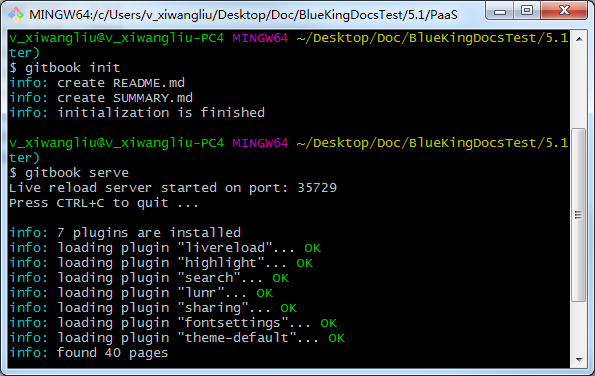

注意 GitBook 初始化时自动在当前目录生成了 README.md 文件，在本地预览时生成了 _book 目录。
因为 GitBook 初始化时生成的 README.md 和 _book 等文件不用上传，可以使用 gitignore 文件过滤它，也可以直接删除它们。
在文档目录创建 .gitignore 文件，在里面写上不需要上传的文件名即可多个文件用换行符隔开，如：
```bash
root$ cat .gitignore
_book
node_modules
Thumbs.db
ehthumbs.db
Desktop.ini
.DS_Store
```
