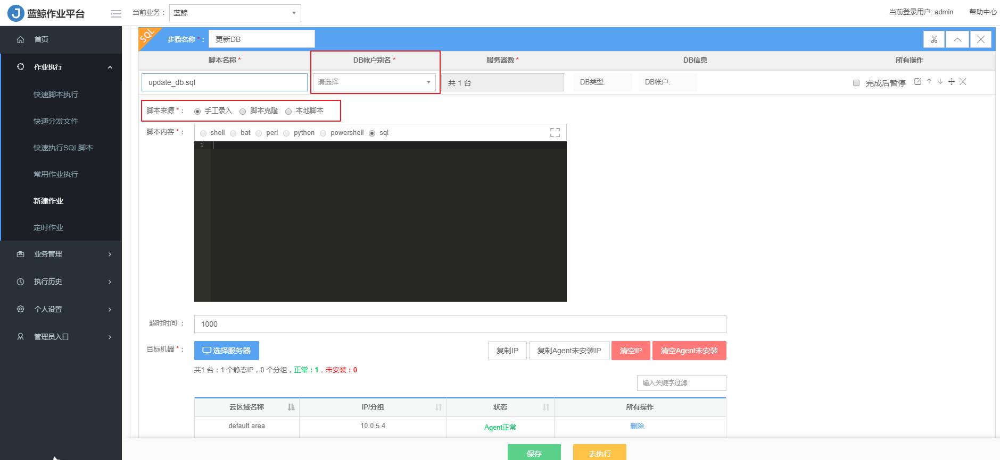
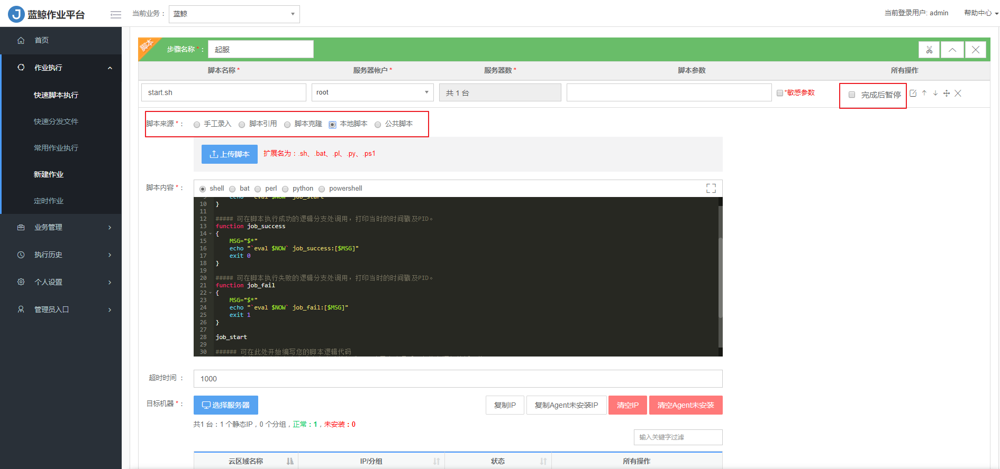

## 场景案例

### 如何快速实现版本发布{#Versions}

面对特定的版本发布或变更的特性场景下，我们往往需要执行多个步骤。例如：停进程、拉取版本文件、分发版本文件到各个节点机器，最后再拉起进程正式对外服务，这就需要很多个步骤执行动作，你也可以选择将所有步骤封装成一个大脚本，但这太低效了，并且维护成本会很高。

作业平台的作业管理模块很好的解决了这个问题，用户只需要将某一个特定业务场景的脚本或文件传输操作，按照顺序组装定制成一个作业任务，以后便可一键完成整套操作，即方便又便于管理。

本篇介绍作业平台如何实现运维中常见的发布场景（包括 `分发补丁`、`停服`、`更新`、`更新DB`、`起服` 5 个步骤），将繁琐的步骤编排成一个完整高效的作业任务。

#### 分发补丁{#Dispense}

添加 `分发补丁` 步骤，上传编写好的 `补丁分发脚本` ，或者可以直接在页面上编写脚本，创建作业时可以选择 【完成后暂停】，可以确保补丁文件是否分发到了目标主机。

#### 停服{#Stopserver}

在同一作业上，添加 `停服` 新步骤，上传编写好的 `停服脚本` ，或者可以直接在页面上编写脚本，创建作业时可以选择 【完成后暂停】，可以确保需要更新主机是否都已停服。

#### 更新补丁{#Updateserver}

在同一作业上，添加 `更新` 新步骤，上传编写好的 `补丁更新脚本` ，或者可以直接在页面上编写脚本，创建作业时可以选择 【完成后暂停】，可以确保需要更新主机是否都已更新。

#### 更新DB{#UpdateDB}

**Note：该项为非必须操作，因为不是每次版本更新都会涉及到 DB 的更新，且该功能只有在 `企业版` 开放使用。**

创建更新 DB 步骤，需要新建 DB 帐户。

如果不需要 DB 更新，请忽略该步骤。

如果需要更新 DB，上传编写好的 `DB 补丁脚本` ，或者可以直接在页面上编写脚本，创建作业时可以选择 【完成后暂停】，可以确保 DB 是否已经被更新。

#### 起服{#Startserver}

当所有的步骤都被无误的执行了，接下来就将服务启动起来。在同一作业上，添加 `起服` 新步骤，上传编写好的 `起服脚本` ，或者可以直接在页面上编写脚本，创建作业时可以选择 【完成后暂停】，可以确保需要更新主机的服务是否都已启动。

该作业任务适用于每一次的版本发布更新任务，在往后的每一次任务中，都能实现一键完成整套操作，即方便又便于管理。

最后，来看下整个完整高效的作业任务图，

