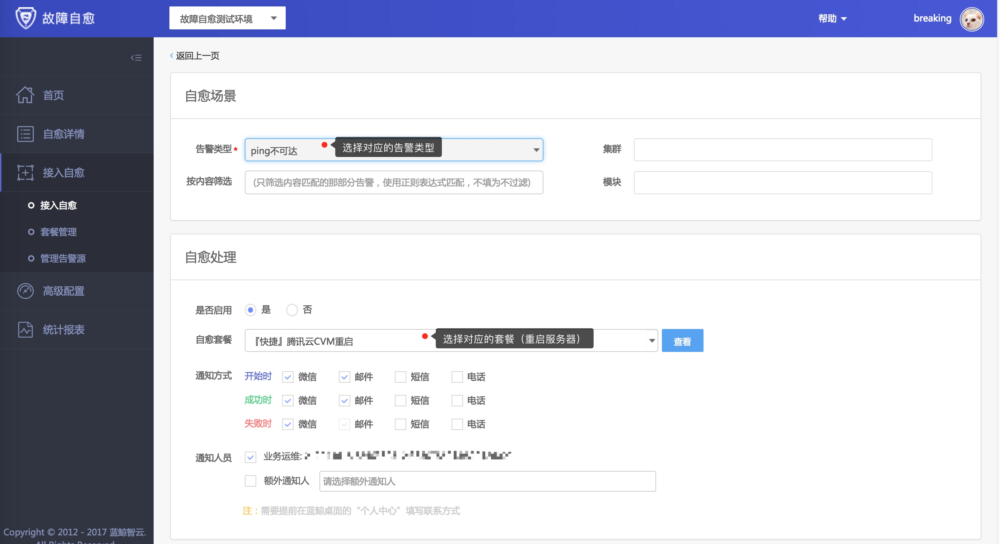

## PING告警

产生PING告警，当然我们第一时间想到的是重启服务器。

**1. 接入自愈**
所以，我们把 `ping不可达`告警接入`『快捷』腾讯云CVM重启`快捷套餐

**2. 自愈详情**
在自愈详情中，你可以找到对应的自愈记录。

点击 ，可以看到这个自愈单据的执行详情。

当执行失败时，你还可以选择重试。

>目前仅腾讯云版蓝鲸将腾讯云CVM重启接口对接到蓝鲸PaaS的ESB中，企业版/社区版需要做二次开发（第一步：把重启接口对接ESB，第2步：二次开发或等待故障自愈开放蓝鲸ESB套餐.
