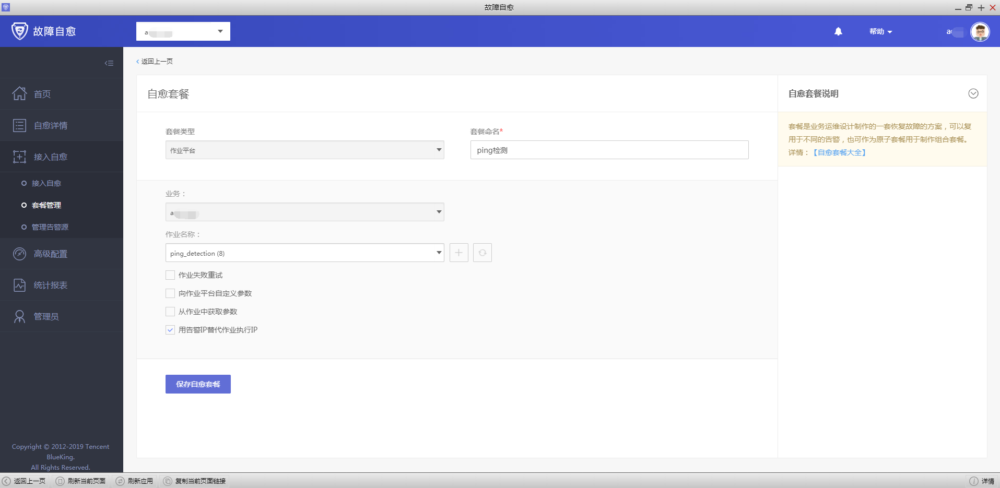
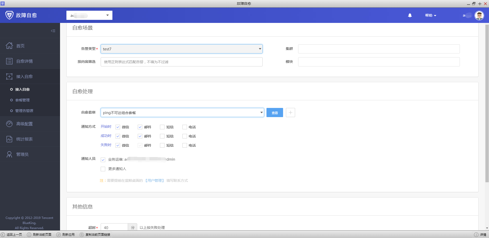

## 带审批ping告警组合套餐接入流程

产生PING告警，服务器故障，首先要做故障检查（再次Ping一次，或者调用一次），发送审核通知（包含故障检查的内容），用户审核即可重启。 （适用保守的传统企业）

需要提前准备：

1. 需要先配置企业微信,注册链接：https://work.weixin.qq.com/ ，
注意：开启微信端口80443
2. 蓝鲸故障自愈 APP 已经正常运行 创建故障自愈APP请参照[微信审批接入流程](https://docs.bk.tencent.com/product_white_paper/fta/Advanced_Features/WeChat_approval_access_process.html)。

**第一步：准备好组合套餐中每个原子（节点）的套餐。**

1.配置ping检测的原子套餐，可以在作业平台写个简单的ping检测脚本，再去故障自愈中配置ping检测的自愈套餐。

2.ping检测没有异常，则发送正常通知。如ping检测异常，则发送审批通知，用户审批通过即可重启，审批如果不通过，则发送审批失败通知。

2.1 配置ping检测正常通知

2.2 配置审批套餐

2.3 配置重启套餐，因为是简单模拟，所以只是echo了一下重启成功，实际应用时要调用在ESB上注册重启服务器接口（物理机），如果是虚拟机，需要自己写脚本来调用虚拟机的接口

**第二步：配置组合套餐，并接入故障自愈，接入故障自愈这里选择REST默认分类是为了方便触发告警，实际应用选择ping不可达告警类型。**

**第三步：触发告警，完成自愈**

1.触发告警，由于这里是做测试，就不拿生产环境了，用REST API可以更方便的产生告警，完整流程请参照 [REST API推送](https://docs.bk.tencent.com/product_white_paper/fta/Getting_Started/Integrated_RestAPI_Push.html)。

2.ping检测没有异常，则发送正常通知。如ping检测异常，则发送审批通知，用户审批通过即可重启，审批如果不通过，则发送审批失败通知。

2.1 ping检测异常，发送审批通知，用户审批通过即可重启

3.回到故障自愈中，查看自愈详情

