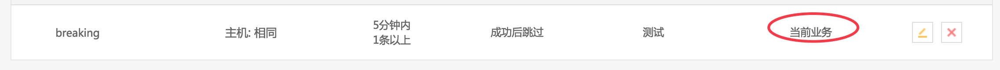

## 设置全局收敛规则

默认手动添加的收敛规则的生效范围是 `当前业务`，如果希望在全业务下都生效，可以在Django后台设置。

**1. 任意找一个业务设置收敛规则**

添加收敛规则


收敛规则添加成功




**2. 在Django后台修改生效范围**

使用管理员角色访问以下地址

```
http://${PaaS_URL}/o/bk_fta_solutions/admin/fta_solutions_app/incidentdef/
```
在Django后台修改生效范围


找到刚添加的收敛规则，将其`业务编码`修改为0 （即对所有业务生效.）

访问`告警收敛`可以发现 `规则来源` 从  `当前业务` 换成了 `系统内置`

收敛规则来源修改


**3. 在不同业务下测试，均生效**

在A业务下测试收敛规则


在B业务下测试收敛规则


