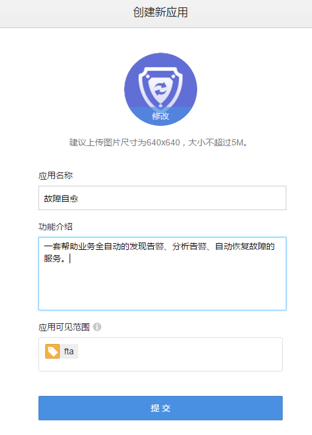
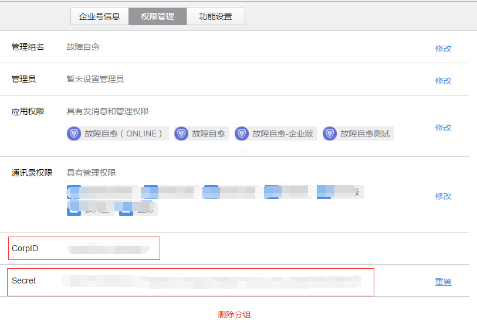

## 故障自愈，微信审批接入流程
需要提前准备：

1. 微信企业号一个，注册链接：https://work.weixin.qq.com/wework_admin/register_wx?from=wxqy_register
2. 蓝鲸故障自愈 APP 已经正常运行
3. 外网域名一个，能代理访问到故障自愈 APP weixin api（可通过nginx,apache等），下面以mycompany.com做示例

>微信审批分两种：
一种是回复指令审批，适合组合套装中的【通知或审批】套餐，
还有一种需要在微信页面审批（通过菜单进入），适合告警收敛的【异常防御需审批】。这些都需要一个企业号应用为载体，下面以故障自愈应用为例，指引接入审批流程，相关参数可按照配置自行修改。

**第一步：新建应用**

1、入口:
>企业号后台管理页面 -> 应用中心 -> 自建应用-> 新建应用

2、操作步骤：
点击创建应用，选择消息型应用，上传自己LOGO，填写应用名称，请根据人员选择可见范围，点击提交完成。
>名称填写：故障自愈
>功能介绍：一套帮助业务全自动的发现告警、分析告警、自动恢复故障的服务。

截图示例如下

**注意：** 可见范围，请务必保证审批管理员，业务管理员可见。

**第二步：配置回调参数**

此模式适用指令回复审批

1、入口：
> 应用中心 -> 故障自愈 -> 模式选择|回调模式

2、操作步骤：
在对应栏填写下面的默认值即可
>URL：http://mycompany.com/o/bk_fta_solution/wechat/entry/
>Token：FTAToken
>EncodingAESKey：FTAEncodingAESKeyFTAEncodingAESKey923456781

截图示例如下：

**注意：** 上面TOKEN和EncodingAESKey都是默认参数，请在APP配置后，务必修改Token和EncodingAESKey

**第三步：配置审批菜单**

此模式适合收敛审批

1、入口：
> 应用中心 -> 故障自愈 -> 模式选择|回调模式 -> 自定义菜单|设置

2、操作步骤：
1) 点击右边+号按钮，输入名称后，事件类型为调整到网页，输入跳转地址完成，
2) 点下右下方保存按钮后，发布即可，菜单会在5分钟内生效。
> 菜单名称：审批列表
> 跳转链接: http://mycompany.com/o/bk_fta_solution/wechat/todo/

截图示例如下：
完成后，企业号接入就完成了， 下一步需要把生成的token等配置到自愈APP中。

**第四步：配置故障自愈APP**

配置完APP后，才能发送审批消息，对于一些特殊处理的静态资源路径，API路径，也需要在这里配置

1、入口：
> admin页面：http://mycompany.com/o/bk_fta_solution/doc/wechat_config/

也可以在后台admin页面右上角->微信审批配置 ，进入

2、 配置页面示例如下：

下面对每个配置项详解。

- 微信端地址（外网可访问）：
填写外网能访问的域名，url到wechat/结束，如上面的域名应该填写：
>http://mycompany.com/o/bk_fta_solution/wechat/

- 微信端静态资源地址（外网可访问）：
默认即可，如果nginx做了路径映射，或者使用CDN，需要填写绝对路径，如：
> /static/wechat/ （默认）
> http://mycompany.com/o/bk_fta_solution/static/wechat/ （绝对路径，适合nginx做了路径映射，或者CDN场景）

- TOKEN和EncodingAESKey：
TOKEN对应第二步中，配置回调参数中的Token。注意，如果这里修改，在上面配置也需要同步修改
EncodingAESKey对应第二步中，配置回调参数中的EncodingAESKey，注意，如果这里修改，上面配置也需要同步修改，长度固定为43个字符

- 微信企业号ID和企业号Secret：
企业号ID和Secret需要在企业号中获取，入口在设置->权限管理中，如果没有，新建一个管理组即可。

- 微信消息的Agent_ID:
Agent_ID在创建完企业号应用就可以获取到，在应用中心->故障自愈，进入即可看到

- 审批管理员：
审批管理员是一个组超级用户，可以接受到任意审批消息，也可以审批任意的收敛审批。填写对应的名称，以逗号分隔即可。

注意，名称是已经在企业号注册的用户。

- 配置自愈套餐（选择审批套餐类型）:
1、创建审批套餐

1.1	在接入自愈流程中，告警类型选择 REST默认分类，这里选择REST默认分类是为了方便触发告警，实际使用过程中，请根据自己实际需求选择告警类型。

1.2	触发告警

完整流程请参照 [REST API推送](https://docs.bk.tencent.com/product_white_paper/fta/Getting_Started/Integrated_RestAPI_Push.html)。

2、审批套餐执行详情

