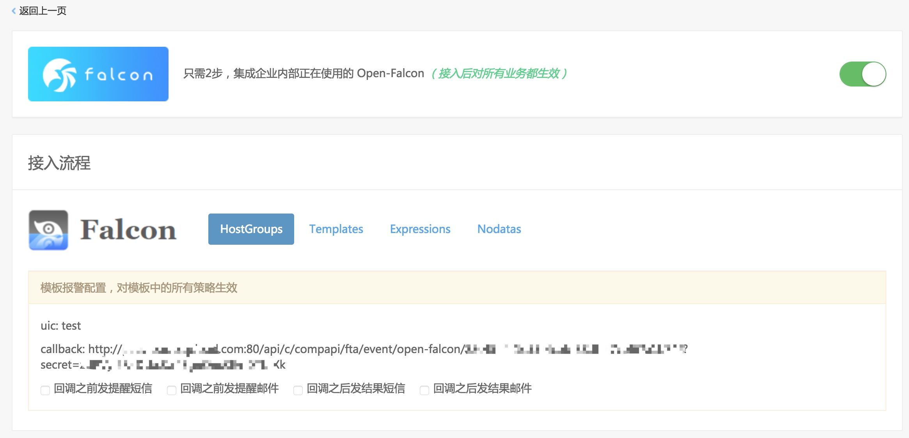

## 对接Open-falcon

对接 Open-falcon 的机制：Open-falcon 模板中包含 callback（回调）功能，在回调地址中填写故障自愈分配给 Open-falcon 的告警接收地址。

1. Open-falcon模板中添加故障自愈的 Callback 地址。

2. Open-falcon告警自愈历史
下面是Nginx模块磁盘告警的自愈示例，匹配Nginx模块的磁盘清理套餐，清理Nginx模块的日志文件，整个过程不到30秒。

3. Open-falcon告警处理的特别之处，Open-Falcon的资源标识 `endpoint` 默认是主机名，于是故障自愈将蓝鲸CMDB自动上报的主机名转换为IP，然后在做匹配、告警自动处理。
