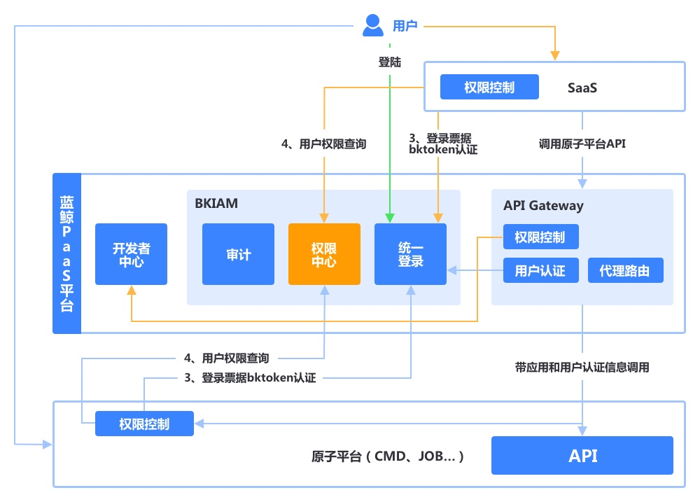
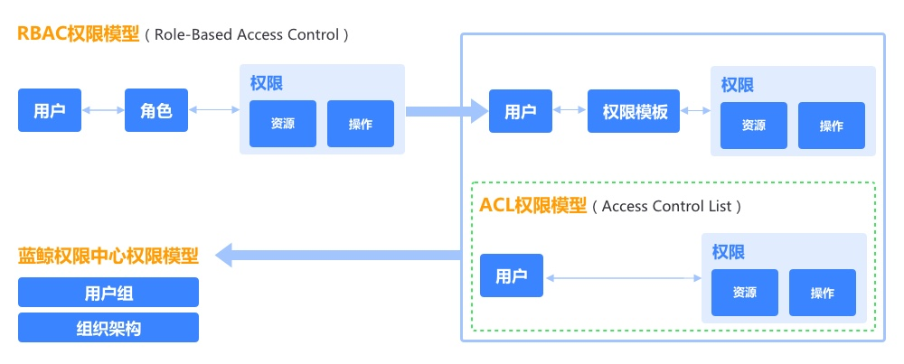

## 产品简介

蓝鲸权限中心是蓝鲸智云提供的集中权限管理服务，主要用于蓝鲸体系内各平台和 SaaS 的权限集中接入，以及提供细化到具体资源实例的资源访问权限控制。

### 蓝鲸权限中心权限模型

蓝鲸权限中心的权限模型是基于 **RBAC **(Role-Based Access Control)和**ACL**(Access Control List)的权限原则基础上，增加了**用户组**和**组织架构**的权限管理。

