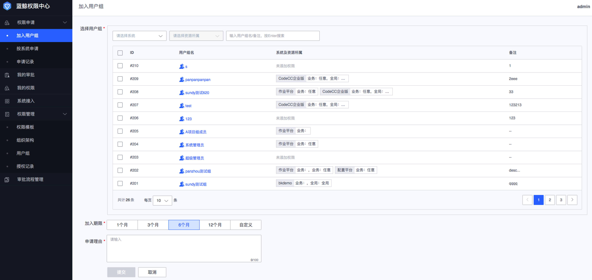

### 加入用户组
蓝鲸权限中心默认会初始化两类用户组：**超级管理员**、**系统管理员**（系统接入后自动生成），超级管理员组是权限最高的组，具备蓝鲸平台的所有权限，相当于root权限，系统管理员组则拥有对应系统的所有权限，其他用户组为管理员创建，用户申请加入对应的组，审批通过后可以**直接继承组的权限**。

#### 申请加入用户组
1. 在**权限申请**菜单下，点击**加入用户组**；
2. 根据需要过滤**系统、资源所属**，搜索“用户组名”筛选出需要申请加入的用户组；
3. 勾选需要申请加入的用户组，如需要可点击**用户组名**查看改组具体的权限，或者通过**系统及资源所属**来帮助识别目标用户组；
4. 勾选好用户组后，选择**加入期限**，同一个组下的用户拥有相同的组期限，但是可以有不同的有效期；
5. 最后填写申请加入用户组的**申请理由**，点击**提交**，提交后会自动走管理员设置好的审批流程，审批通过后用户具备相应的权限。
