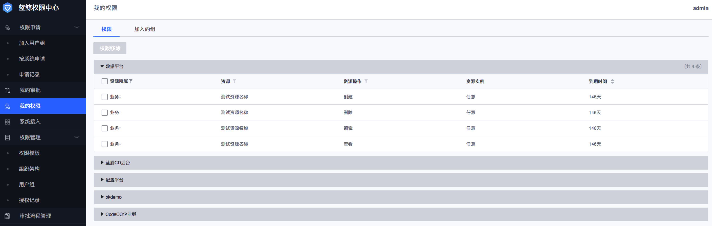

### 我的权限
该页面展示个人权限（个人权限组成参考 [用户](/4.产品功能/管理员/UserManage.md) 介绍）和加入的组信息，用户可以在此页面进行**权限移除、续期、交接**等操作。

#### 查询权限
1. 在**我的权限**菜单下，点击**权限**tab页，该tab页以系统分块的方式展示了个人所有的权限信息；
2. 点击资源所在的系统表格，依次过滤**资源所属、资源、资源操作**，可以筛选出具体某类资源的所有操作权限。

#### 移除权限
1. 在**我的权限**菜单下，点击**权限**tab页；
2. 勾选需要移除的权限，点击**权限移除**按钮，二次确认后将对应权限的全部拷贝移除（包括继承组织的、继承组织所在用户组、继承用户组的以及个人直接获得权限）。

#### 查询继承组织的权限
1. 在**我的权限**菜单下，点击**加入的组**tab页；
2. 在**组织**分类下，点击对应的**组织**可以查看继承该组织的权限。

#### 查询继承用户组的权限
1. 在**我的权限**菜单下，点击**加入的组**tab页；
2. 在**用户组**分类下，点击对应的**用户组**可以查看继承该用户组的权限。

#### 退出用户组
1. 在**我的权限**菜单下，点击**加入的组**tab页；
2. 在**用户组**分类下，找到需要退出的组，点击**退出该组**，二次确认后即可退出对应的组，退出组后，同时也会失去对该组权限的继承。
