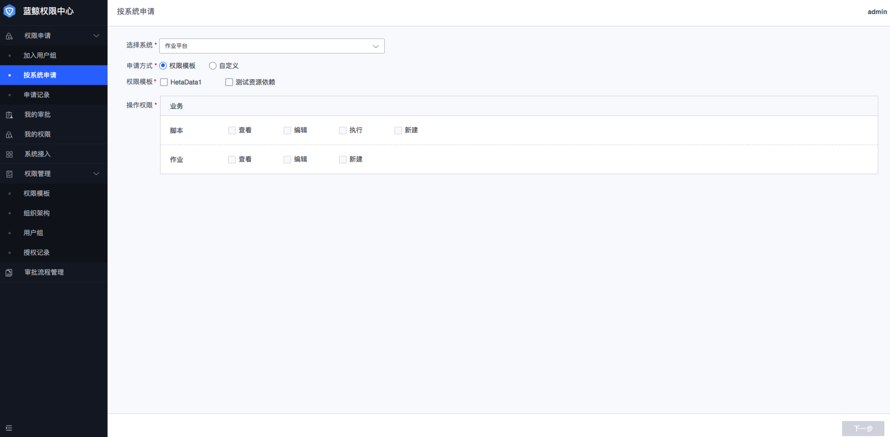

### 按系统申请
各系统接入权限中心后，用户可以通过权限中心申请对应系统的权限，按系统申请的方式，通常是用户只需要该系统权限。

#### 申请某个系统的权限
1. 在**权限申请**菜单下，点击**按系统申请**；
2. 选择需要申请的**系统**，选择**申请方式**，申请方式分两种：**权限模板**（管理员制定好的权限套餐）、**自定义**（用户根据需要勾选），如果选择的是**权限模板**，则需要勾选具体的**权限模板**名称，操作权限根据用户勾选的权限模板自动勾选，用户无法更改；如果选择的是**自定义**，用户可以勾选需要的操作权限；
3. 勾选好操作权限后，点击**下一步**，**关联资源实例**，选择**申请期限**，填写**申请理由**，点击**提交**，提交后会自动走管理员设置好的审批流程，审批通过后用户具备相应的权限。
