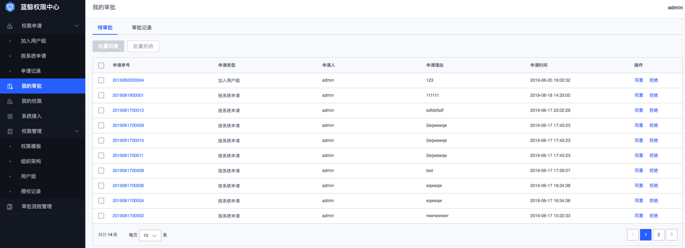

### 我的审批
我的审批页面包括个人 **待审批**（仅当审批单据流转到本人才有具体的待审批单据）和已审批的**审批记录**。

#### 处理待审批单据
1. 在**我的审批**菜单下，点击 **待审批** tab页面。
2. 找到需要处理的待审批单据，点击 **申请单号** 查看具体的申请单详情，可以直接在弹出的侧边页面进行审批操作，或者在**待审批**列表中直接进行单据处理：**同意** 表示该审批节点通过，**拒绝** 表示该审批节点不通过，后续流程将终止。

#### 查询审批记录
1. 在 **我的审批** 菜单下，点击**审批记录**tab页面；
2. 选择 **时间范围** 、填写**单号**进行审批单筛选。
