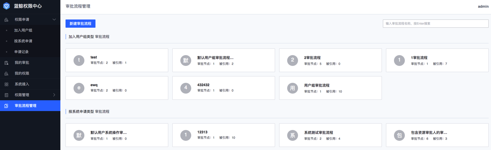

###审批流程管理
企业根据实际需求可以创建不同的审批流程，满足不同场景的权限申请审批需求，目前支持：**直接上级、资源审批人、指定审批人、超级管理员、系统管理员**等审批人员角色，管理员可以在审批流程节点中选择使用。

- **直接上级**：为申请人的leader，数据来源于“蓝鲸用户管理-组织架构-用户-直接上级”。
- **资源审批人**：为资源实例的审批人，默认为资源实例的创建者，可以在“我的审批资源（普通用户）”或者“资源审批人管理（管理员）”中修改审批人。
- **指定审批人**：为指定的用户/组织/用户组。
- **超级管理员**：为权限中心的超级管理员组，默认用户为admin，可以在“超级管理员”组中编辑用户。
- **系统管理员**：为系统接入时指定的管理员，可以在对应的“系统管理员”组中编辑用户。

####新建审批流程
审批流程分为**加入用户组**、**按系统申请**两类，按系统申请类审批流程可以关联到资源实例级别的审批，加入用户组类审批流程是针对用户通过**加入用户组**，
1. 在**审批流程管理**菜单下，点击**新建审批流程**；
2. 填写**审批流程名称**，选择**审批流程类型**，
    - **加入用户组**类型：该类型审批流程只能被用户组引用；
    - **按系统申请**类型：该类型审批流程只能被具体的资源操作引用，管理员可以通过选择**适用范围**，给不同系统制定不同的审批流程或专属的审批流程。  

3. **定义审批流程节点**，点击**添加审批节点**，选择对应的**审批人**，根据企业需要继续添加其他审批节点，最后填写**备注**信息，点击**提交**保存当前审批流程。

####删除审批流程
蓝鲸权限中心在初始化的时候默认会在两类审批流程下各生成一个默认的审批流程（默认只有**超级管理员**一个审批节点），管理员可以随时修改，默认的审批流程不能删除，
1. 在**审批流程管理**菜单下，找到需要删除的审批流程；
2. 将鼠标移到待删除审批流程卡片上，右侧会浮现**删除**小图标，如果该审批流程已被引用，则删除小图标不可点击，否则点击**删除**小图标，二次确认后可将该审批流程删除。

####查看/编辑审批流程
1. 在**审批流程管理**菜单下，找到需要查看/编辑的审批流程；
2. 在弹出的页面即为**查看**页面，在查看页面可以直接进行内容编辑；
3. 需要编辑时，可以重命名**审批流程名称**，如果是**按系统申请**类型的审批流程，可以编辑**适用范围**；
4. 需要编辑时，可以直接修改**定义审批流程节点**，对流程节点进行**上移、下移、编辑（仅指定审批人可编辑人员）、删除**操作；
5. 需要编辑时，可以直接修改**备注**信息。
