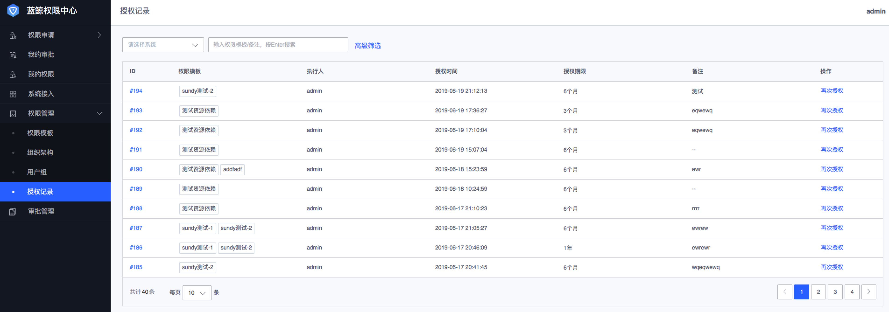

### 授权记录
授权记录是管理员所有的授权操作历史，通过授权记录可以进行**再次授权**操作。
**权限模板的更新不会自动同步给授权记录**。

#### 查找管理员的授权记录
1. 在**权限管理**菜单下，单击**授权记录**；
2. 在授权记录列表上方点击**高级筛选**，选择**执行人**，选择**授权时间**范围，点击右侧**过滤**按钮，即可查找出想要查找的授权人记录。

#### 查找授权给某用户的授权记录
1. 在**权限管理**菜单下，单击**授权记录**；
2. 在授权记录列表上方点击**高级筛选**，选择**授权用户**，选择**授权时间**范围，点击右侧**过滤**按钮，即可查找出授权给某用户的授权记录。

#### 再次授权
1. 在**权限管理**菜单下，单击**授权记录**；
2. 在授权记录列表上，查找需要再次授权的授权记录，点击右侧**再次授权**操作，在弹出的页面，可以重新**关联资源实例**，选择**授权对象**，在弹出的**添加成员**窗口可以选择**用户、组织或用户组**，选择**授权期限**，填写**备注**信息，单击**提交**可以完成一次再次授权操作。
