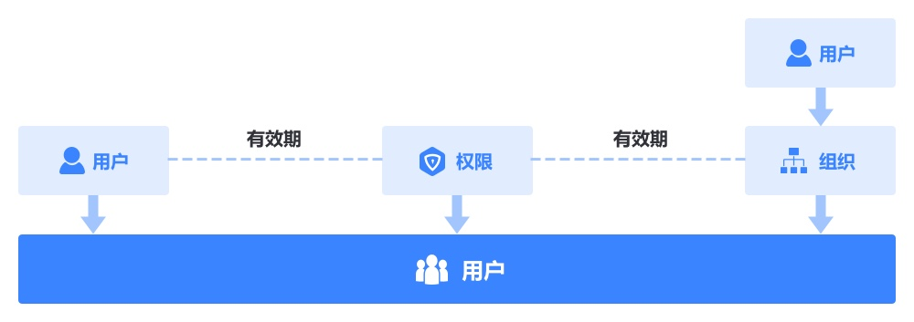

### 用户组
蓝鲸权限中心默认会初始化两类用户组：**超级管理员**、**系统管理员**（系统接入后自动生成），超级管理员组是权限最高的组，具备蓝鲸平台的所有权限，相当于root权限，系统管理员组则拥有对应系统的所有权限，管理员可以按需添加其他管理员人员，其他用户组企业可以根据根据需求来进行创建和管理，一个用户组由以下元素组成：
- **用户或组织**：管理员可以给一个组添加用户或者组织。
- **权限**：一个组可以添加多个系统的权限，组内用户自动继承组权限（注：组内的组织不继承组权限，仅组织里的用户才继承）。
- **有效期**：组内用户继承组的权限是相同的，但是有有效期限制，并且有效期可以不一样（如张三的有效期是1个月，李四的有效期是3个月），权限到期后有效期为0，用户需续期才能继续使用权限。

#### 创建用户组
1. 在**权限管理**菜单下，单击**用户组 > 新建**；
2. 依次输入**组名**，添加**组成员**（可以添加用户或组织）、**组权限**并且**关联资源实例**，选择**权限有效期**，填写**备注**信息，单击**确定**。

#### 管理组成员
1. 在**用户组**页面，找到需要管理的用户组，单击用户组名；
2. 单击**成员**，可以管理组成员。
    - 添加组成员：单击**添加成员**，从弹出的组织架构对话框中选择需要添加到组中的用户或组织，单击确定（也可以用户组列表的**操作**里直接**添加成员**）。
    - 移除个人：找到要移除的用户，单击**移除个人**，可将该用户移除，移除后将不再直接继承该组的权限。
    - 移除组织：找到要移除的组织，单击**移除组织**，可将该组织移除，移除后组织内的用户将不再继承该组权限。
    - 批量移除：勾选需要批量移除的用户或组织，单击**批量移除**，可以将用户或组织移除。

#### 管理组权限
1. 在**用户组**页面，找到需要管理的用户组，单击用户组名；
2. 单击**权限**，可以管理组权限。
    - 添加权限：单击**添加权限**，勾选需要添加的权限模板并且关联资源实例，单击提交（也可以用户组列表的**操作**里直接**添加权限**）。
    - 批量移除：勾选需要批量移除的权限，点击**批量移除**，可以将权限批量移除。

#### 重命名用户组
1. 在**用户组**页面，找到需要重命名的用户组；
2. 在**操作**里更多，点击**重命名**，输入新用户名，单击确定。

### 删除用户组
1. 在**用户组**页面，找到需要删除的用户组；
2. 在**操作**里更多，点击**删除**，可以将该组删除，删除后组内成员和组权限将一并删除，请谨慎操作。
