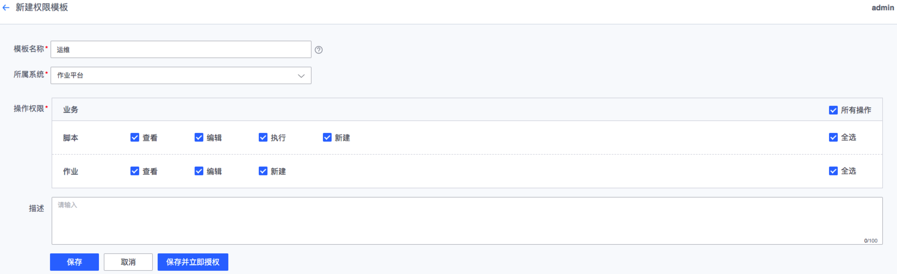

### 权限模板
权限模板是系统常用操作权限的组合，类似RBAC权限模型里的角色概念，权限模板在管理员授权和用户申请的时候都需要被引用，所以尽量命名容易辨识的名字。需要强调的是，在蓝鲸权限中心里，**权限模板的更新不会影响已授权用户，除非再次针对用户授权，再次授权后的权限是叠加而不是覆盖**。

#### 新建权限模板
1. 在**权限管理**菜单下，单击**权限模板 > 新建模板**；
2. 依次输入**模板名称**，选择**所属系统**，勾选**操作权限**，填写**备注信息**，单击**保存**，如需立即授权，请点击**保存并立即授权**。

#### 复制权限模板
1. 在**权限管理**菜单下，单击**权限模板**；
2. 找到需要复制的**权限模板**，在操作列点击**复制**，修改**模板名称**，编辑**操作权限**，填写**备注**信息，点击**保存**。

#### 批量删除权限模板
1. 在**权限管理**菜单下，单击**权限模板**；
2. 勾选需要删除的**权限模板**，点击**批量删除**，模板删除后不影响已授权用户。

#### 授权/批量授权
1. 在**权限管理**菜单下，单击**权限模板**；
2. 找到需要被授权的**权限模板**，可勾选多个系统的权限模板，点击**授权/批量授权**，在弹出的页面**关联资源实例**，选择**授权对象**，在弹出的**添加成员**窗口可以选择**用户、组织或用户组**，选择**授权期限**，填写**备注**信息，单击**提交**可以完成一次授权，如需针对同样的权限再次授予他人，可以在**[授权记录](/4.产品功能/管理员/GrantHisManage.md)**再次授权。
