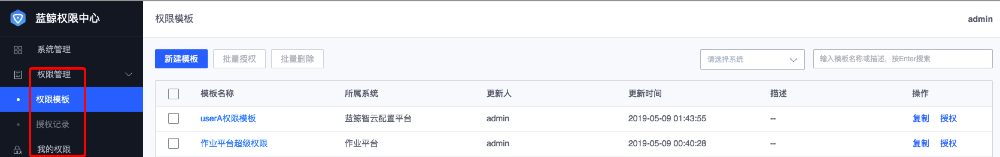
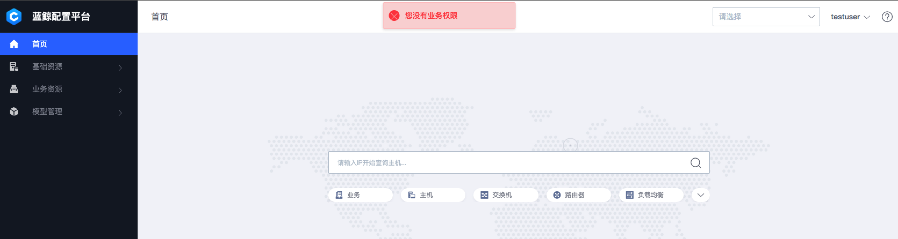
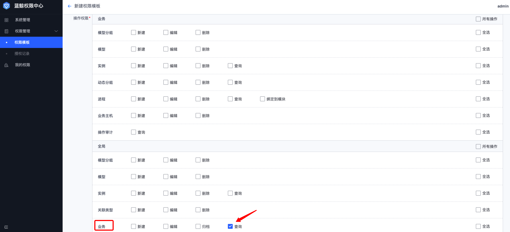
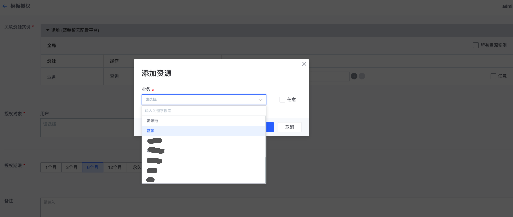
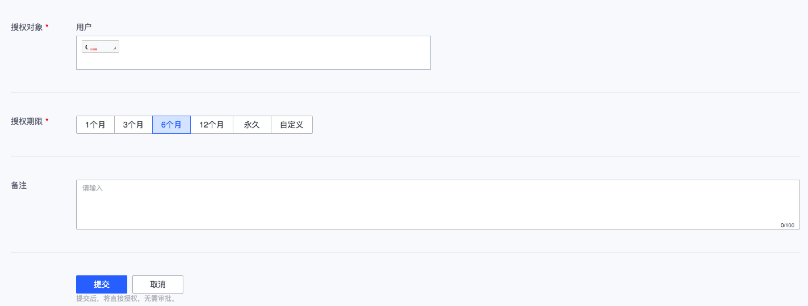
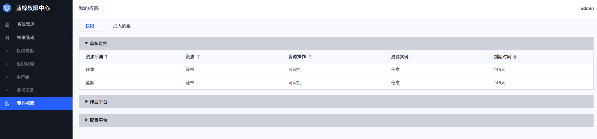
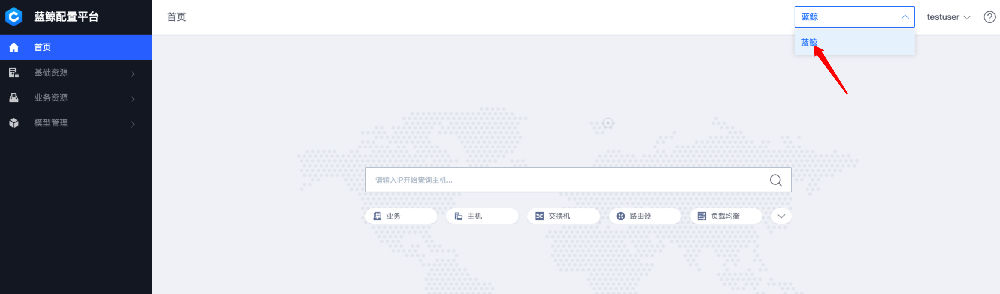

## 场景案例{#Case}

### 如何给用户授权

对于蓝鲸内置的平台，如作业平台、配置平台、标准运维等等，已经默认接入权限中心，蓝鲸体系产品部署完成后，默认可以直接通过权限中心来实现用户对各平台的资源访问控制。

接下来模拟如何授予普通用户权限，使其可以获得**配置平台**的相关操作权限。

操作页面包括：权限管理相关页面、我的权限页面


#### 具体授权步骤

```
1. 使用普通用户testuser（只要是普通用户就行，如没有先用admin登录蓝鲸创建）登录，打开配置平台,提示没有业务权限。
```

```
登录账户：admin（默认初始化为超级管理员）
2. 填写权限模板名称
3. 系统选择配置平台
4. 勾选相应的操作权限，勾选全局下的【业务-查询】权限
```

```
5. 保存并立即授权
6. 选择业务对应的具体实例，我们选择【蓝鲸】业务
```

```
7. 填写授权testuser用户（正式版会支持用户组/组织架构的授权）
8. 选择授权期限，默认为6个月
9. 点击“提交”给用户授权
```

```
10. 用testuser被授权的用户账户重新登录，点击“我的权限”查看被授予的权限
```

```
11. 打开配置平台可以查看【蓝鲸】业务权限
```

