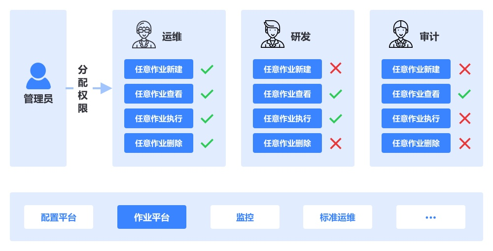

## 场景案例

蓝鲸权限中心的应用场景，旨在帮忙企业各种常用的权限管理方式。

###  企业内不同岗位员工分权管理

企业A有多种岗位：研发、运维、审计，企业要求不同岗位的员工具有的权限不一样，并且可以最小化粒度授权。

### 企业内按照组织架构分级授权

企业A在刚创业时，员工比较少，所有的权限都由老板分配，随着业务线的扩展，员工越来越多，为了方便员工的权限管理，老版决定不再统一分配，下放给各部门自行进行权限管理。

