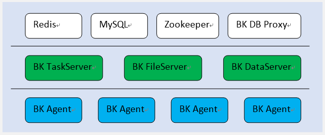

## 产品架构图

- BK Agent：蓝鲸智能Agent程序，需要安装在业务需要管控的实体机、虚拟机或者容器里面。BK Agent 的启动需要按照要求输入制定的命令行参数，并依赖配置文件。BK Agent是蓝鲸管控平台提供三大服务能力的实际执行者， BK Agent 所在机器的通讯策略、网络状况需要在安装前调整好才能发挥其所有能力。

- BK TaskServer：蓝鲸管控平台任务及控制服务端程序。该程序提供对集群内Agent的管理能力，并支持对 Agent 批量下发和执行命令或脚本。

- BK FileServer：蓝鲸管控平台文件传输控制服务端程序。该程序对指定范围内 Agent 节点提供 BT 种子服务，保证对传输的安全性、不同区域及业务模块间的隔离性，并控制BT传输在有限的贪婪特性范围内。单独部署 BK FileServer 并不能提供文件传输服务，受限于安全性考虑，BK FileServer 必须和 BK TaskServer 配合才能完成完整的文件分发流程。

- BK DataServer：蓝鲸管控平台数据传输服务端程序。该服务端主要提供对 Agent 采集的数据进行汇聚、分类、流转能力。对于普通的千兆网卡机器，BK DataServer 能够最大提供 100MB/s 的数据处理能力。BK DataServer 可以单独为用户提供数据服务，而不需要其他服务端程序配合。

- BK DB Proxy：蓝鲸管控平台 Redis 集群管理模块。通过代理对 Redis 的操作，完成 Redis 分布式集群的统一管控，支持 hash 写入，多备份写入等。

- Redis：Redis在本系统中提供工作区数据缓存作用。

- MySQL：主要存放系统管理相关的数据，便于对系统完成基础的管理和监控。

- Zookeeper：Zookeeper 主要提供对集群的管理能力。包括集群中不同节点间的相互发现，有效性探测等。
