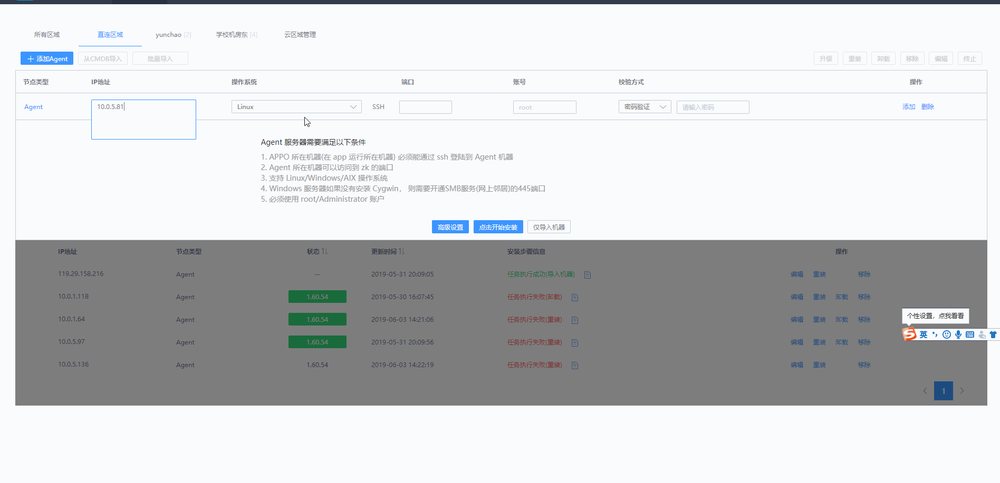

>>## Agent 安装 {#Agent}
>>
>>用户的业务主机和蓝鲸系统所在的局域网或相同或不同，安装 Agent 包含 3 场景：直连区域的 Agent 安装、非直连区域的 Proxy 安装、非直连区域的 P-Agent 安装。
>>
>>### 前置步骤
>>
>>配置 Nginx 服务器地址。**首次使用节点管理，必须先配置 Nginx 服务器地址，否则无法使用其他功能。**
>>
>>
>>
>>**Note：**
>>
>>- 配置包来源：
>>  URL 用于在 Agent/Proxy 所在机器上下载对应的 Agent/Proxy/P-Agent 安装包。填写不含包名的 URL。 对于社区版/企业版， URL 通常是: `http://<NGINX_IP>:<NGINX_PORT>/download`。内网 URL 用于下载直连区域的包，外网 URL 用于下载云区域 ( Proxy 及 P-Agent 节点)的安装包。
>>- 任务安装项目：
>>  安装 Proxy 时，需要从 Nginx 所在机器下载 Linux、Windows、AIX 所需要的 Agent 安装包，约 150 - 180 M大小, 若 Proxy 到 Nginx之 间的网络带宽较小，容易超时。可以通过增大超时时间进行设置。
>>- GSE Server 信息：
>>  Agent/Proxy 启动后，会尝试连接 GSE, 直连区域通常内网 IP，非直连区域使用外网 IP，这里的内外网不是严格意义上的私有地址或公网地址，只要能让 Agent 连上的 IP 都可以。通常在 NAT 网络环境中需要注意使用 NAT 地址。
>>
>>
>>## 直连区域安装 Agent{#District}
>>
>>当安装 Agent 的受控主机与蓝鲸系统中的 GSE Server，在同一局域网内（非跨云），受控主机能通过局域网建立与 GSE Server 的 TCP/UDP 链接。这种情况下，选择直连区域安装 Agent 。
>>
>>### 安装要求
>>
>>- 要能正常安装 Agent，除了满足网络策略要求 (参考 [开通网络策略要求](9.附录/network_policy.md)) 外, 还要满足：
>>
>> >* 操作系统可以是 `Linux/Windows/Windows(Cygwin)/AIX` 。
>> * 目前仅支持 `root/Administrator` 账户。
>> * 若为 `Linux/Windows(Cygwin)`：
>> * 要能从 `APPO` 所在机器机器 `ssh` 登陆到服务器 (因此必须运行了 SSH 服务\)。
>> * 操作系统上安装了 wget，curl 命令。
>> * 若为 `Windows` 无 `Cygwin`：
>> * 要能从 `APPO` 访问该机器的 `139，445`端口.\(方法参考 [Windows开 139，445 端口](9.附录/smb.md))。
>> * 若为 `AIX`：
>> * 要能从 `APPO` 所在机器机器 `ssh` 登陆到服务器 \(因此必须运行了 SSH 服务\)。
>>
>>### 操作流程
>>
>>**填写信息 -> 查看满足条件 ->点击开始安装 -> 查看安装步骤详情 -> 查看状态栏**
>>
>>1. 选择直连区域，点击 【+添加agent】 按钮，输入 IP，选择操作系统，输入端口号，输入账号，选择校验方式及密码等信息。
>>
>> 
>>
>>2. 点击【开始安装】。正常情况下，会提示 `添加 Agent节点成功` 安装步骤信息栏则变成动态信息。
>>
>>
>>
>>3. 点击【安装步骤详情】列中的区域位置可以查看安装步骤详情。
>>
>>
>>
>>- 若日志末尾 step6 看到 `operate success `信息，恭喜你，Agent 安装正常了。
>>
>>4. 同时，`Agent` 状态也发生了变化，状态栏是绿色背景且显示版本号信息，安装步骤信息栏则显示 `任务执行成功（安装)`。
>>
>>
>>
>>### 添加主机方式
>>
>>除了 【+添加agent】 这种逐个添加主机的方式，还提供以下方式：
>>
>>* 【从 CMDB 导入】：主机信息已录入 CMDB，可以从 CMDB 批量导入主机。
>>
>> 
>>
>>* 【批量导入】：从 EXCEL 文件中批量导入主机信息，适用于所有各主机密码不一致的场景。
>>
>> **Note：** 为保证导入的可用性，请下载 Agent 主机导入模板，严格按照模板进行填写。
>>
>> 
>>
>>### 仅导入机器
>>
>>主机信息填好后，选择仅导入机器。
>>主机信息仅录入 CMDB，不会安装 Agent。如果想要后续安装，可以点击操作栏 【重装】。
>>
>>
>>
>>
>>### 高级设置
>>
>>主机信息填好后，选择高级设置。
>>适用于复杂的 NAT 网络环境下安装 Agent。需要填写信息：登录 IP、通信 IP、数据 IP、操作系统及端口和账号密码。
>>
>>
>>
>>>**Note：** Agent 服务器需要满足以下条件：
>>>
>>>- APPO 所在机器必须能通过端口服务远程登陆到 Agent 机器。
>>>- Agent 所在机器可以访问到 zk 的端口。
>>>- 支持 Linux/Windows/AIX 操作系统。
>>>- Windows 服务器如果没有安装 Cygwin， 则需要开通 139, 445 端口。
>>>- 必须使用 root/Administrator 账户。
>>
>>### 状态栏
>>
>>- 灰色背景，内容为 `--`，表示未安装，状态未知。
>>- 灰色背景，内容为`XX.XX.XX`，表示已安装, 但状态异常，版本号为: `XX.XX.XX`。
>>- 绿色背景，内容为`XX.XX.XX`，表示 agent 状态正常，版本号为: `XX.XX.XX` 。
>>
>>### 操作
>>
>>编辑。可以对当前主机信息进行编辑。如端口号，账号密码等。
>>
>>
>>
>>
>>- 重装：对当前主机进行重装。
>>- 卸载：卸载当前主机上的 Agent。卸载后，状态变为灰色。但不会从节点管理中消失，也不会从 CMDB 中消失。
>>
>>- 移除：先进行卸载，然后从节点管理中移除，主机只能在 CMDB 中找到。
>>
>>- 终止：可终止以上的重装，卸载，移除 3 种操作。
>>
>>>**Note** ：可在批量操作时采取【终止】操作。
>>>
>>>
