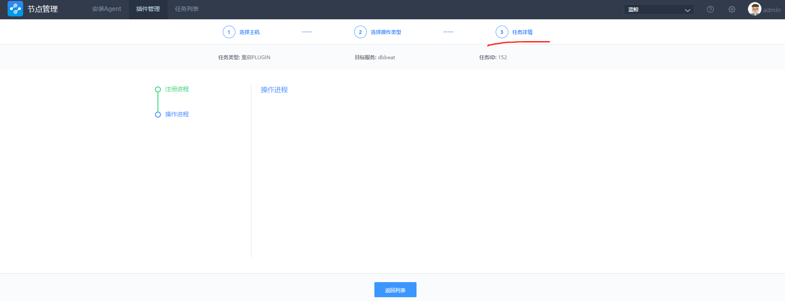

## 插件管理 {#plugins}

插件管理分`进程管理`和`插件更新`两个入门场景，让你快速掌握插件的即插即用、管理更新。

### 前置步骤

平台支持的插件信息是动态加载的，因此在首次使用前，需要先将插件基本信息加载到节点管理中。

- 点击右上角的齿轮按钮 -> 滚动到底部后，点击加载插件基础信息。


- 提示成功后，即可开始使用插件管理功能。

- 原理：插件管理功能通过 GSE Agent 的管控通道来实现。

>**Note :**
>
>从1.1.X 升级上来的用户，以及从社区版 4.X 升级到 5.X 的用户，该步骤页面加载会失败，原因是，加载的信息不存在。
>
>加载插件信息来自于安装 GSE 时打包工具生成的配置文件。该配置文件可以通过以下几种方式生成(在中控机执行)：
>
>```shell
>./bkcec pack gse_plugin
>./bkcec install gse 			# 因为该步骤包含了 pack gse_plugin，所以也可以实现)
>./bkcec pack gse_plugin -u. 	# -u 参数会自动调用节点管理接口写入插件信息
>```
>
>

## 进程管理 {#process}

### 操作流程

**选择目标主机 -> 选择操作类型 ->查看任务详情**

1. 选择要操作的目标主机列表

     > **Note:**
     >
     > 1. GSE Agent 状态不正常的主机不能被选择。
     > 2. 主机列表过多时，可以根据表头上方的查询条件，来缩小或锁定要操作的目标主机列表。


2. 选择功能及插件(进程管理)，点击立即执行。

   

3. 查看任务详情。



## 插件更新{#upgrade}

### 操作流程

**选择目标主机 -> 选择操作类型 ->查看任务详情**

1. 同 [进程管理](5.快速入门/plugins.md#process) 。

2. 选择要更新的插件信息及插件包，并点击执行下一步。


- 保留原有配置文件： 插件更新会将原有的配置文件覆盖，勾选该功能，会保留原插件的配置文件，最后重启进程生效。
- 仅保留文件，不重启进程：保留原有的插件配置文件，但是更新后不会进行重启进程。

>**Note :**
>
>- 上传插件包，请联系运维将插件包上传到中控机的 `/data/src/` 目录并解压。
>- 然后执行 `./bkeec pack gse_plugin` 更新插件信息到 `/data/src` 下。

3. 查看任务详情。


