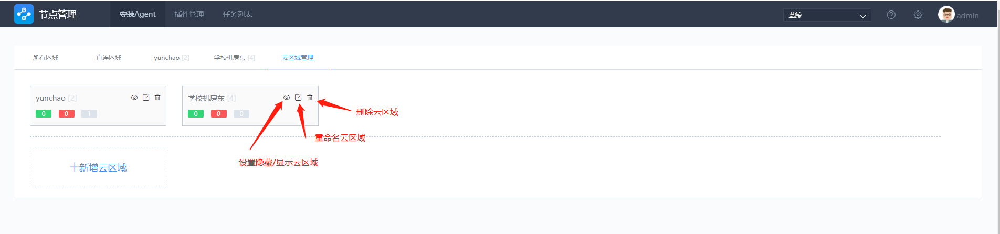

## 安装 Proxy {#Proxy}

安装 Agent 的目标主机与 GSE Server 不在同一局域网，或网络上无法直连，需要通过 Proxy 建立网络联系，这种情况下，需要先安装好 Proxy（数量为1-2台）， 再执行安装 P-Agent 。

### 安装要求

- 安装 Proxy 的主机必须是 Linux 64 位操作系统， 至少有一个 IP 可与 GSE Server 互通。
- 确保 Proxy 服务器能访问 Nginx 服务器。
- 目前仅支持 root 用户进行安装。

### 安装流程

**选择云区域 -> 填写信息 -> 点击 【安装】 -> 步骤详情查看 ->【+添加 P-Agent】 按钮亮起**

1、云区域下的主机，通过 Proxy 进行管理，开始 Proxy 安装前，需要选择云区域。如图：

**【云区域管理】**
需要新建时，选择【云区域管理】创建一个云区域。

- 点击【云区域管理】标签，进入以下界面。

- 云区域管理功能有：【新增】，【隐藏/可见】，【重命名】，【删除】云区域 。

a. 【新增】
点击【+新增云区域】，填写云区域名称。
点击【添加】后，提示 `添加云区域成功`，在云区域名称后面会有一个灰色数字，即为云区域 ID 。

>**Note :**
- CMDB 通过 【云区域 ID】 + 【主机 IP 地址】唯一标识一台主机。
- 手动安装 Agent 时，需要指定的云区域 ID 就来源于此处(箭头所指灰色中括号里的数字)。
- 直连区域的云区域 ID 为 0 。

b. 隐藏/可见：点击实现创建的云区域在标签栏的隐藏/可见，在云区域管理界面可以查看使用状态。

c. 重命名：可以修改创建的云区域名称，不影响云区域 ID 。

d. 删除：可以删除创建的云区域，删除前，必须先清空该云区域下的所有主机。删除以后该云区域彻底移除。

2、页面操作方法与安装直连 Agent 相似，多了一栏：外网 IP。如下：

>**外网IP:**
- 用于节点管理从 ``APPO/APPT`` 所在机器 `SSH` 登陆。

- 用于与 ``GSE`` 建立通信。

>**内网 IP:**
- 用于 ``P-Agent`` 与 ``Proxy`` 通信。

- 用于安装脚本从 ``Proxy`` 通过 `SSH` 登陆到 ``P-Agent`` 机器。

3、填写好信息后，点击 【安装】后，正常情况下，会提示`添加 Proxy 节点成功`。安装步骤信息栏则变成动态信息。

4、安装过程详情可以在`安装步骤信息`中查看。

5、安装成功后，安装步骤信息栏则显示 `任务执行成功（安装)`，【+添加 P-Agent】 按钮亮起，此时代表可以安装 P-Agent 。

### Proxy 节点内容 {#proxy_content}

GSE 相关程序：

- **gse_transit：** 扮演 `gse_data` 角色，如转发数据等。
- **gse_agent：** 扮演 `gse_task` 角色，如任务下发等。
- **gse_opts：** 扮演 `gse_ops` 角色，如告警汇总及转发等。
- **gse_btsvr：** 扮演 `gse_btsvr` 角色，文件分发。

除以上内容外，在安装过程中，还会：

- 在 `Proxy` 节点上安装 `Python`，及用于远程管理 `Windows` 的包 `impacket。`
- `Linux、Window、AIX` 的 Agent 安装包下载到 `Proxy` 机器上的 `/tmp/byproxy`目录下。
