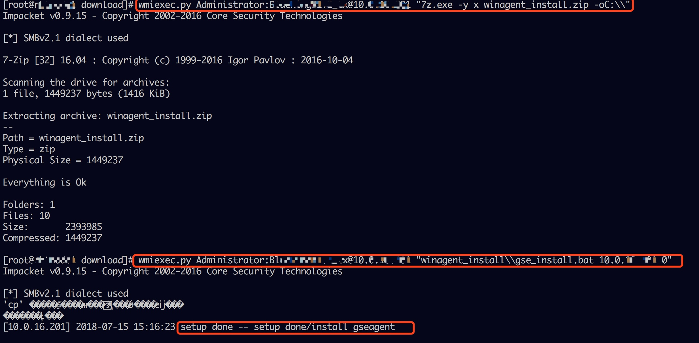

## 手动安装 Agent 使用脚本

**Note：**

通过手动脚本安装 Agent，蓝鲸平台是无法获取到该主机信息。如果需要将主机信息注册到 CDMB，请参考如下方法：

- 通过配置平台将主机导入到 CMDB，详情见 [配置平台]()
- 通过 POST 方式将主机注册到 CMDB，详情见 [注册主机到CMDB](9.附录/add2cmdb.md)

## 直连区域 Linux/Cygwin {#linux}

安装 Linux 与 Windows/Cygwin 下的 安装流程几乎是一模一样的，所以我们放在一块讲。
假设要安装 Agent 的目标机器 IP 为：`10.0.0.1`，步骤如下：

在 [产品架构图](3.产品架构图/architecture.md) 中说过，第一步是：
**1. 登录到目标机器, 然后下载脚本**

```
**[terminal]
**[prompt foo@agent-01 ]**[path ~]**[delimiter $ ]
**[prompt foo@agent-01 ]**[path ~]**[delimiter $ ]
**[prompt foo@agent-01 ]**[path ~]**[delimiter $ ]**[command ssh root@10.0.0.1 ]
... 此处省略登陆提示

**[prompt foo@bar ]**[path ~]**[delimiter # ]**[command wget http://$NGINX_IP:$NGINX_PORT/download/agent_setup_pro.sh]
--2018-07-15 12:03:07--  http://X.X.X.X/download/agent_setup_pro.sh
Connecting to X.X.X.X:80... connected.
HTTP request sent, awaiting response... 200 OK
Length: 35618 (35K) [application/octet-stream]
Saving to: ‘agent_setup_pro.sh’

100%[============================================================>]35,618      --.-K/s   in 0s

2018-07-15 12:03:07 (566 MB/s) - ‘agent_setup_pro.sh’ saved [35618/35618]
**[prompt foo@bar ]**[path ~]**[delimiter # ]**[command chmod +x agent_setup_pro.sh]


# 我们先看看用法
**[prompt foo@bar-01 ]**[path ~]**[delimiter # ]**[command ./agent_setup_pro.sh -h]
usage: agent_setup_pro.sh -m { proxy | client } OPTIONS

OPTIONS list:
  -h    print this help page
  -r    uninstall
  -m    'proxy' or 'client'
        client: a host under the control of proxy or server
        proxy: manager node of seperated datacenter
  -b    bridge mode of client, client connected to proxy
  -u    upgrade agent/proxy, with configuration reserved/migrated
  -t    set timeout limit
  -e    NAT ip, connecte by appo/proxy
  -g    NGINX server ip:port

when BRIDGE MODE enabled
  -i    datacenter id, valid in proxy mode. default: 2
  -w    ip1,ip2, comma seperated ip address of multiple proxy server
  -l    ip1,ip2, comma seperated ip address of multiple proxy server
  -o    target host ip list file. default: /tmp/hosts.config
        each line format like this:
          IP PORT USERNAME IDENTITY

```

**参数说明 {#script_argument}**

```
-r  卸载 Agent
-m  指定安装的节点类型, 可以是 Proxy, Client 中的一种
-b  开启该选项时,表示安装在云区域, 此时需要提供 -i 指定云区域 ID
-u  升级功能, 保留原有配置
-t  设置安装超时时间, 默认 500s, 执行该脚本时, 若在脚本执行阶段超时, 可以用该参数调整超时时间
-e  指定识别 IP, 数据 IP, 它将被注册到 CMDB 的主IP. 默认为 ifconifg/ipconfig 输出中的第一个私有地址 IP

当指定了 -b 参数或节点类型为 Proxy 时(安装云区域), 还可以指定一下选项
-i  云区域 ID. 默认为 2
-w  Proxy 节点的外网 IP (与 GSE 建立连接用)
-l  Proxy 节点的内网 IP (与 P-Agent 建立连接)
-o  指定 P-Agent 的 主机信息列表, 后接文件名. 文件内容格式为空白分隔的固定列文本
    IP 端口 用户名 密码/密钥文件绝对路径 操作系统类型 是否有 Cygwin
```

> **[info] Note:**
>
> 1. -i 指定的云区域 ID，需要先在页面上创建好云区域才能获得. 详情请参考 [非直连区域的Proxy安装](5.快速入门/proxy.md#Proxy) 。
> 2. 要卸载 Agent，使用所提供的脚本(包括后续 AIX、Windows 安装的脚本) 带上  -r 参数即可完成卸载。

**2. 执行安装 {#exec_script}**

```
**[terminal]
**[prompt foo@bar ]**[path ~]**[delimiter # ]
**[prompt foo@bar ]**[path ~]**[delimiter # ]**[command ./agent_setup_pro.sh -m client]
```
输出如图所示:


> 1. TIPS：执行该命令前，设置环境变量 HASTTY=1，可以显示上图中的绿色字体。
> 2. 脚本执行过程中，需要使用到 wget 命令下载 Agent 安装包，所以先确保 wget 命令可用。


- Note
    1. 需要以 root 用户执行，或者 sudo 执行。
    2. 输出中的第一列是自动获取的本机内网 IP。若为空，说明在部署蓝鲸后台时，没有针对非标准私有 IP进行处理。
    3. 出现 2 的情况时，可以有另一种方法处理： 带上 -e 参数指定内网 IP，此时上报的数据也将关联该 IP。如图：
       ```
       **[terminal]
       **[prompt foo@bar ]**[path ~]**[delimiter # ]**[command ./agent_setup_pro.sh -m client -e 10.0.0.2 ]
       ```

<hr>

## 直连区域 Windows  {#windows}

这节描述的是，Windows 服务器的 Agent安装方法(有 Cygwin的 Windows 也适用)。

要求如下：
- Windows 机器的 139，445 端口开放可用访问(可用在安装完后关闭)。
- Windows 机器的密码不含 @ ' " \  等特殊符号(不完全统计, 提示密码错误时可以检查一下)。


因为所需的安装包及脚本都在 Nginx 服务器，所以，方便起见，之间在 Nginx 服务器上操作。

**1. 首先登陆到 Nginx 所在机器**

进入$INSTALL_PATH/miniweb/download 目录。 以下截图中的 $NGINX_IP需替换成实际的 IP


**2. 安装 所需的 python 包**
解压 pypkgs.tgz，并使用 /opt/py27/bin/pip 安装包。
```
**[terminal]
**[prompt foo@nginx-1 ]**[path ~]**[delimiter # ]
**[prompt foo@nginx-1 ]**[path ~]**[delimiter # ]
**[prompt foo@nginx-1 ]**[path download]**[delimiter # ]**[command tar xf pypkgs.tgz]
**[prompt foo@nginx-1 ]**[path download]**[delimiter # ]**[command /opt/py27/bin/pip install --no-index --find-links=./pypkgs -r pypkgs/requirements.txt]
...
...
...
Successfully installed Naked-0.1.31 PyYAML-3.12 appnope-0.1.0 certifi-2017.11.5 cffi-1.11.2 cryptography-2.1.4 decorator-4.1.2 impacket-0.9.15 ipaddress-1.0.19 ipython-5.0.0 pathlib2-2.3.0 pexpect-4.3.1 ptyprocess-0.5.2 pyasn1-0.4.2 pycrypto-2.6.1 scandir-1.6 shellescape-3.4.1 six-1.11.0
```

执行过程无报错，末尾出现 Successfully installed ... 时，表示 ok，否则需要根据实际情况处理异常后继续。

**3. 上传安装包到 Windows 机器**

步骤安装完成后， 可以使用 wmiexec.py 命令了， 使用方法可以`执行 wmiexec.py -h` 查看帮助

```
**[terminal]
**[prompt root@nginx-1 ]**[path download]**[delimiter # ]
**[prompt root@nginx-1 ]**[path download]**[delimiter # ]
**[prompt root@nginx-1 ]**[path download]**[delimiter # ]**[command wmiexec.py Administrator:密码@IP地址 "put gse_client-windows-x86_64.tgz"]
Impacket v0.9.15 - Copyright 2002-2016 Core Security Technologies

[*] SMBv2.1 dialect used
[*] Uploading gse_client-windows-x86_64.tgz to C:\gse_client-windows-x86_64.tgz
**[prompt root@rbtnode1 ]**[path download]**[delimiter # ]**[command wmiexec.py Administrator:密码@IP地址 "put gse_client-windows-x86.tgz"]
Impacket v0.9.15 - Copyright 2002-2016 Core Security Technologies

[*] SMBv2.1 dialect used
[*] Uploading gse_client-windows-x86.tgz to C:\gse_client-windows-x86.tgz
**[prompt root@rbtnode1 ]**[path download]**[delimiter # ]**[command wmiexec.py Administrator:密码@IP地址 "put winagent_install.zip"]
Impacket v0.9.15 - Copyright 2002-2016 Core Security Technologies

[*] SMBv2.1 dialect used
[*] Uploading winagent_install.zip to C:\winagent_install.zip
**[prompt root@rbtnode1 ]**[path download]**[delimiter # ]**[command wmiexec.py Administrator:密码@IP地址 "put 7z.dll"]
[root@rbtnode1 download]# wmiexec.py Administrator:密码@IP地址 "put 7z.dll"
Impacket v0.9.15 - Copyright 2002-2016 Core Security Technologies

[*] SMBv2.1 dialect used
[*] Uploading 7z.dll to C:\7z.dll
**[prompt root@rbtnode1 ]**[path download]**[delimiter # ]**[command wmiexec.py Administrator:密码@IP地址 "put 7z.exe"]
Impacket v0.9.15 - Copyright 2002-2016 Core Security Technologies

[*] SMBv2.1 dialect used
[*] Uploading 7z.exe to C:\7z.exe
**[prompt root@rbtnode1 ]**[path download]**[delimiter # ]**[command wmiexec.py Administrator:密码@IP地址 "put normaliz.dll"]
Impacket v0.9.15 - Copyright 2002-2016 Core Security Technologies

[*] SMBv2.1 dialect used
[*] Uploading normaliz.dll to C:\normaliz.dll
**[prompt root@rbtnode1 ]**[path download]**[delimiter # ]
```

安装包默认上传到 C: 根目录下

**4. 远程执行安装脚本**

完成 Windows Agent 安装的脚本是 gse_install.bat。
- gse_install.bat 参数说明

```
第一个参数: 主机内网 IP, 连接 GSE, 及绑定数据, 都是用这个 IP
第二个参数: 云区域 ID, 下图中为 0
第三个参数: Proxy 内网 IP, 多个 Proxy 用短横线分隔
第三个参数: Proxy 外网 IP, 多个 Proxy 用短横线分隔
```

> **[info]**
>
> 若第一个参数为  -r，则其忽略其余参数，直接卸载 Agent。

接下来登陆远程 Windows，解压安装包， 然后执行安装即可。
注意：执行脚本 gse_install.bat 时的第二个参数是 0，表示云区域 ID。

```
**[terminal]
**[prompt root@nginx-1 ]**[path download]**[delimiter # ]
**[prompt root@nginx-1 ]**[path download]**[delimiter # ]**[command wmiexec.py Administrator:密码@IP地址 "7z.exe -y x winagent_install.zip -oC:\\"]
**[prompt root@nginx-1 ]**[path download]**[delimiter # ]**[command wmiexec.py Administrator:密码@IP地址 "winagent_install\\gse_install.bat IP地址 0 "]
```
输出如下所示：


<hr>

## 直连区域 AIX {#aix}

AIX 上 Agent 的 安装与 Windows 类似，都是从 Server 把包推到 AIX 机器上，然后执行脚本安装。差别在于推送和远程执行都是通过 ssh。

aix 要推送的文件有两个，一个安装包，一个脚本。
执行安装前需要保证 AIX 机器上有 tar 解压工具。

在 Nginx 服务器的 miniweb/download 目录执行一下命令。**注意自行替换命令中的 IP**
```
**[terminal]
**[prompt root@nginx-1 ]**[path download]**[delimiter # ]
**[prompt root@nginx-1 ]**[path download]**[delimiter # ]
**[prompt root@nginx-1 ]**[path download]**[delimiter # ]**[command ssh root@10.0.0.1 -p 22 mkdir /tmp/byproxy]
**[prompt root@nginx-1 ]**[path download]**[delimiter # ]**[command scp gse_client-aix_powerpc.tgz agent_setup_aix.ksh root@10.0.0.1:/tmp/]
**[prompt root@nginx-1 ]**[path download]**[delimiter # ]**[command ssh root@10.0.0.1 "sh /tmp/agent_setup_aix.ksh -m client -i 0"]
```
